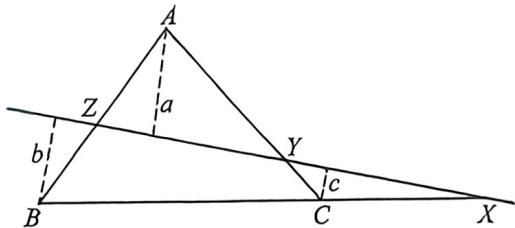

## 考点一_向量的数量积计算

## 一、常规建系

![[高中/总复习/二轮/2026版高中《MST新思路思维拓展》二轮复习专题/上册/板块3_三角/考点一_向量的数量积计算/questions/Q00092943.md]]
![[高中/总复习/二轮/2026版高中《MST新思路思维拓展》二轮复习专题/上册/板块3_三角/考点一_向量的数量积计算/questions/Q00092944.md]]
![[高中/总复习/二轮/2026版高中《MST新思路思维拓展》二轮复习专题/上册/板块3_三角/考点一_向量的数量积计算/questions/Q00093295.md]]
![[高中/总复习/二轮/2026版高中《MST新思路思维拓展》二轮复习专题/上册/板块3_三角/考点一_向量的数量积计算/questions/Q00093335.md]]

## 二、极化恒等式

![[高中/总复习/二轮/2026版高中《MST新思路思维拓展》二轮复习专题/上册/板块3_三角/考点一_向量的数量积计算/questions/Q00092948.md]]
![[高中/总复习/二轮/2026版高中《MST新思路思维拓展》二轮复习专题/上册/板块3_三角/考点一_向量的数量积计算/questions/Q00093354.md]]
![[高中/总复习/二轮/2026版高中《MST新思路思维拓展》二轮复习专题/上册/板块3_三角/考点一_向量的数量积计算/questions/Q00092950.md]]

## 三、梅氏定理

梅氏定理: X、Y、Z 分别是 $\triangle ABC$ 三边所在直线 BC、CA、AB 上的点则 X、Y、Z 共线的充分必要条件是 $\frac{CX}{XB} \cdot \frac{BZ}{ZA} \cdot \frac{AY}{YC} = 1$

如图，X、Y、Z三点中只有一点在三角形边的延长线上，而其它两点在三角形的边上；

证明:如图所示,设 A、B、C 到直线 XYZ 的距离分别为 a、b、c.

(1)先证明必要性,即若 X、Y、Z 三点共线,则 $\frac{CX}{XB} \cdot \frac{BZ}{ZA} \cdot \frac{AY}{YC}=1$ ,因为 $\frac{CX}{XB}=\frac{c}{b}, \frac{BZ}{ZA}=\frac{b}{a}, \frac{AY}{YC}=\frac{a}{c}$ ,三式相乘得 $\frac{CX}{XB} \cdot \frac{BZ}{ZA} \cdot \frac{AY}{YC}=\frac{c}{b} \cdot \frac{b}{a} \cdot \frac{a}{c}=1$ ,

(2)再证明充分性,即若 $\frac{CX}{XB}\cdot\frac{BZ}{ZA}\cdot\frac{AY}{YC}=1$ ,则 $X、Y、Z$ 三点共线,设直线 $XZ$ 交 $AC$ 于 $Y'$ ,由已证必要性

得: $\frac{CX}{XB} \cdot \frac{BZ}{ZA} \cdot \frac{AY'}{Y'C} = 1$ , 又因为 $\frac{CX}{XB} \cdot \frac{BZ}{ZA} \cdot \frac{AY}{YC} = 1$ , 所以 $\frac{AY'}{Y'C} = \frac{AY}{YC}$ , 因为 $Y'$ 和 $Y$ 或同在 $AC$ 线段上, 或同在 $AC$ 边的延长线上, 并且能分得比值相等, 所以 $Y'$ 和 $Y$ 比重合为一点, 也就是 $X, Y, Z$ 三点共线.

![[高中/总复习/二轮/2026版高中《MST新思路思维拓展》二轮复习专题/上册/板块3_三角/考点一_向量的数量积计算/questions/Q00093280.md]]
