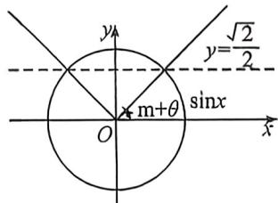

<!-- question-source:start -->
例27 (2026 届江苏南通海门第一次调研 T14) 若对于 $\forall \theta \in \mathbb{R}$ , 总 $\exists x \in \left[\frac{\pi}{4} + \theta, m + \theta\right]$ , 使得 $\sin x \leqslant \frac{\sqrt{2}}{2}$ , 则实数 $m$ 的最小值为 \_\_\_\_.

<!-- question-source:end -->

![[高中/总复习/二轮/2026版高中《MST新思路思维拓展》二轮复习专题/上册/板块3_三角/考点三_三角不等式与三角最值/questions/answers/Q00093158A1.md]]
