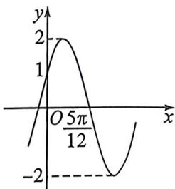

<!-- question-source:start -->
例28 (25·南宁一中高三开学考 T11·多选)已知函数 $f(x) = A\sin (\omega x + \varphi) \left( A > 0, \omega > 0, -\frac{\pi}{2} < \varphi < \frac{\pi}{2} \right)$ 的部分图象如图所示, 则 ( )

A. $f(x)$ 的最小正周期为 $\pi$

B. 当 $x \in \left[-\frac{\pi}{4}, \frac{\pi}{4}\right]$ 时, $f(x)$ 的最小值为 -1

C. 函数 $f(x)$ 在点(0,1)处的切线方程为 $y = 2\sqrt{3}x + 1$

D. $f(x)$ 在区间 $\left[\theta, \theta + \frac{\pi}{3}\right](\theta \in \mathbf{R})$ 上的最大、最小值分别记为 $M, N$ , 则 $M - N$

的最大值为 $2 \sqrt{3}$
<!-- question-source:end -->

![[高中/总复习/二轮/2026版高中《MST新思路思维拓展》二轮复习专题/上册/板块3_三角/考点三_三角不等式与三角最值/questions/answers/Q00093294A1.md]]
