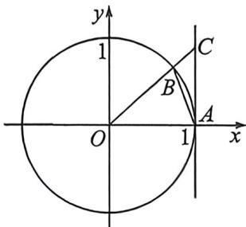
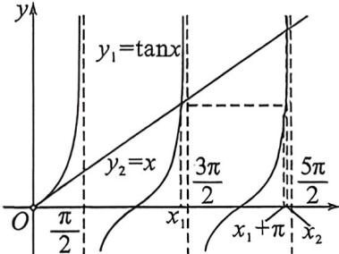

> [!faq]- 例题解析
>
> > [!success]- **【答案】** ABC
>
> > [!note]- **【解析】**
> > 解析 对于 A, 设 $\angle AOB = x, x \in \left(0, \frac{\pi}{2}\right)$ ，作单位圆如图 1，与 x 轴交于 A，则 $A(1, 0)$ ，过点 A 作 AC 垂直于 x 轴，交射线 OB 于点 C，连接 AB，由三角函数的定义可知， $AC = \tan x, \angle AOB = x$ ，设扇形 OAB 的面积为 $S_{1}$ ，则 $S_{\triangle OAC} > S_{1}$ ，即 $\frac{1}{2} \tan x > \frac{1}{2} x$ ，故 $\tan x > x$ ，当 $x \in \left(0, \frac{\pi}{2}\right)$ 时，有不等式 $\tan x > x$ ，故 A 正确；
> >
> > 
> > 图1
> >
> > 
> > 图2
> >
> > 对于 B, 画出 $y_1 = \tan x, x \in \left\{x \mid 0 < x < \frac{5\pi}{2} \text{ 且 } x \neq \frac{\pi}{2} \text{ 且 } x \neq \frac{3\pi}{2}\right\}$ 与 $y_2 = x$ 的函数图象, 如图 2, 由图可以看出 $x_1 \in \left(\pi, \frac{3\pi}{2}\right), x_2 \in \left(2\pi, \frac{5\pi}{2}\right)$ , 故 $\sin x_1 < 0, \sin x_2 > 0$ , 所以 $\sin x_1 < \sin x_2$ , 故 B 正确;
> >
> > 对于 $C, y_1 = \tan x$ 的最小正周期为 $\pi$ , 由图象可知 $x_2 > x_1 + \pi$ , 所以 $x_2 - x_1 > \pi$ , 故 $C$ 正确;
> >
> > 对于 D, 由 $x_{1} \in \left(\pi, \frac{3\pi}{2}\right)$ , $x_{2} \in \left(2\pi, \frac{5\pi}{2}\right)$ , 得 $\cos x_{1} < 0$ , $\cos x_{2} > 0$ , 所以 $\cos x_{1} < \cos x_{2}$ , 故 D 错误.
> >
> > 故选 **ABC**.
