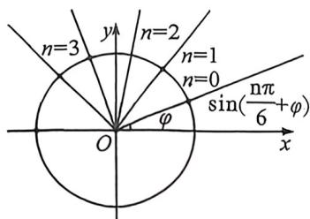
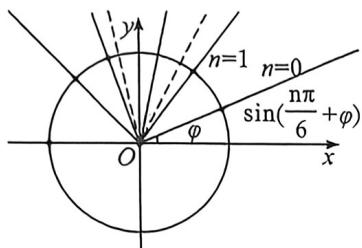

> [!faq]- 例题解析
>
> > [!success]- **【答案】** 详见解析
>
> > [!note]- **【解析】**
> > 解析 当周期性, 可把图像上的点在单位圆上呈现, 共分为 12 个区域, 以初相位 $\varphi$ 对应的点为第一个点, 每个区域内 3 个点, 当第三个点对应的纵坐标等于第四个点对于纵坐标时, 此时 $\sin\left(\frac{n\pi}{6}+\varphi\right)$ 的最大值有最小值 $\sin\left(\frac{2\pi}{6}+\varphi\right)=\sin\left(\frac{3\pi}{6}+\varphi\right) \Rightarrow \varphi=\frac{\pi}{12}$ , 故 $\sin\left(\frac{n\pi}{6}+\varphi\right)$ 的最大值此时等于 $\sin\frac{5\pi}{12}=\frac{\sqrt{6}+\sqrt{2}}{4}$
> >
> > 
> >
> > 
