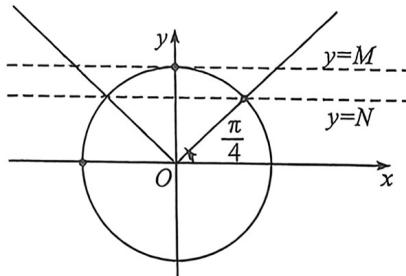

> [!faq]- 例题解析
>
> > [!success]- **【答案】** BD
>
> > [!note]- **【解析】**
> > 解析 A. 因为 $f(x)=\sin\left(2\omega x-\frac{\pi}{6}\right)$ ，所以 $f(x)$ 的最小周期为 $T=\frac{2\pi}{2\omega}=\frac{\pi}{\omega}$ ，故 A 错误；对于 B，因为 $f\left(\frac{\pi}{3}\right)=\sin\left(\frac{2\omega\pi}{3}-\frac{\pi}{6}\right)=0$ ，所以 $\frac{2\omega\pi}{3}-\frac{\pi}{6}=k\pi, k\in Z$ ，整理得 $\omega=\frac{1}{4}+\frac{3k}{2}, k\in Z$ ，因为 $\omega>0$ ，所以当 k=0 时， $\omega$ 取得最小值 $\frac{1}{4}$ ，故 B 正确；
> >
> > 对于 C，若 $\omega=\frac{1}{2}$ ，则 $f(x)=\sin\left(x-\frac{\pi}{6}\right)$ ，那么 $f(x+\varphi)=\sin\left(x+\varphi-\frac{\pi}{6}\right)$ ，
> >
> > 当 $x\in\left(0,\frac{8\pi}{3}\right)$ 时， $x+\varphi-\frac{\pi}{6}\in\left(\varphi-\frac{\pi}{6},\varphi+\frac{5\pi}{2}\right)$ ，区间长度为 $\frac{8\pi}{3}$ 且不包括端点，
> >
> > 结合正弦函数 $y = \sin x = \frac{1}{2}$ 的解的分布，可知 $f(x + \varphi) = \sin \left(x + \varphi - \frac{\pi}{6}\right) = \frac{1}{2}$ 最多有3个不相等实数解，故C错误；
> >
> > 
> >
> > 对于D,当 $\omega = 1$ 时，函数 $f(x) = \sin \left(2x - \frac{\pi}{6}\right)$ ，其最小正周期 $T = \frac{2\pi}{2} = \pi$ ，而区间 $\left[t - \frac{\pi}{8}, t + \frac{\pi}{8}\right]$ 的长度为 $\frac{\pi}{4}, 2x - \frac{\pi}{6}$ 长度为 $\frac{\pi}{2}, h(t) = M(t) - m(t)$ ，则 $h(t)$ 的最小值时为单位圆重合最多的时候，所以 $M = 1, N = \frac{\sqrt{2}}{2}$ ，
> >
> > $h(t)$ 的最小值为 $1-\frac{\sqrt{2}}{2}$ ，故 D 正确。
> >
> > 故选 **BD**.
