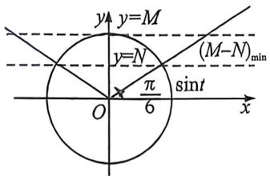
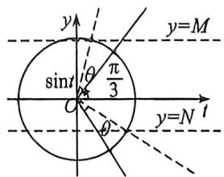
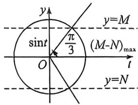

> [!faq]- 例题解析
>
> > [!success]- **【答案】** ACD
>
> > [!note]- **【解析】**
> > 解析 由图, $A=2,f(0)=2\sin\varphi=1$ , 因 $-\frac{\pi}{2}<\varphi<\frac{\pi}{2}$ , 则 $\varphi=\frac{\pi}{6}$ . 又由图可得 $\frac{5\pi}{12}=\frac{\pi-\varphi}{\omega}=\frac{\pi-\frac{\pi}{6}}{\omega}$ . $\omega=2$ , 则 $f(x)=2\sin\left(2x+\frac{\pi}{6}\right)$ .
> >
> > 对于 A, 最小正周期为: $\frac{2\pi}{2}=\pi$ , 故 A 正确;
> >
> > 对于 $\mathrm{B}, x \in \left[-\frac{\pi}{4}, \frac{\pi}{4}\right]$ 时， $2x + \frac{\pi}{6} \in \left[-\frac{\pi}{3}, \frac{2\pi}{3}\right]$ ，因函数 $y = \sin x$ 在 $\left[-\frac{\pi}{3}, \frac{\pi}{2}\right]$ 上单调递增，在 $\left(\frac{\pi}{2}, \frac{2\pi}{3}\right]$ 上单调递减，当 $x \in \left[-\frac{\pi}{4}, \frac{\pi}{4}\right]$ 时， $f(x)$ 的最小值为 $\min \left\{2\sin \left(-\frac{\pi}{3}\right), 2\sin \frac{2\pi}{3}\right\} = 2\sin \left(-\frac{\pi}{3}\right) = -\sqrt{3}$ ，故 B 错误；
> >
> > 对于 C, 易得 $f(0)=1$ , $f'(x)=4\cos\left(2x+\frac{\pi}{6}\right)$ , $f'(0)=4\cos\frac{\pi}{6}=2\sqrt{3}$ , 则切线方程为: $y-1=2\sqrt{3}x$ , 即 $y=2\sqrt{3}x+1$ , 故 C 正确;
> >
> > 对于D, 法一: $x \in \left[\theta, \theta + \frac{\pi}{3}\right] \Rightarrow 2x + \frac{\pi}{6} \in \left[2\theta + \frac{\pi}{6}, 2\theta + \frac{5\pi}{6}\right]$ , 注意到 $2\theta + \frac{5\pi}{6} - \left(2\theta + \frac{\pi}{6}\right) = \frac{2\pi}{3}$ , 则令 $2\theta + \frac{\pi}{6} = t$ , 则问题相当于求 $y = 2\sin x$ 在 $\left[t, t + \frac{2\pi}{3}\right]$ 上最大值与最小值的差值. 由周期性, 则只需要研究 $y = 2\sin x$ 在 $t \in \left[-\frac{\pi}{2}, \frac{3\pi}{2}\right)$ 上的相关性质. 若 $\left[t, t + \frac{2\pi}{3}\right] \subseteq \left[-\frac{\pi}{2}, \frac{\pi}{2}\right] \Rightarrow t \in \left[-\frac{\pi}{2}, -\frac{\pi}{6}\right]$ , 由正弦函数单调性, 结合和差化积公式可得 $M - N = 2\left[\sin \left(t + \frac{2\pi}{3}\right) - \sin t\right] = 4\cos \left(t + \frac{\pi}{3}\right)\sin \frac{\pi}{3} = 2\sqrt{3}\cos \left(t + \frac{\pi}{3}\right)$ ; $t \in \left[-\frac{\pi}{2}, -\frac{\pi}{6}\right] \Rightarrow t + \frac{\pi}{3} \in \left[-\frac{\pi}{6}, \frac{\pi}{6}\right]$ , 则此时 $M - N \in [3, 2\sqrt{3}]$ ;
> >
> > 若 $-\frac{\pi}{2} < t < \frac{\pi}{2} < t + \frac{2\pi}{3} < \frac{3\pi}{2} \Rightarrow t \in \left(-\frac{\pi}{6}, \frac{\pi}{2}\right)$ , 此时 $M = 2, N = \min \left\{2\sin t, 2\sin \left(t + \frac{2\pi}{3}\right)\right\} = \begin{cases} 2\sin t, & \pi - t \geqslant t + \frac{2\pi}{3} \\ 2\sin \left(t + \frac{2\pi}{3}\right), & \pi - t < t + \frac{2\pi}{3} \end{cases}$
> >
> > 即 $M - N = \left\{ \begin{array}{l} 2 - 2\sin \left(t + \frac{2\pi}{3}\right), \frac{\pi}{6} < t < \frac{\pi}{2} \\ 2 - 2\sin t, -\frac{\pi}{6} < t \leqslant \frac{\pi}{6} \end{array} \right.$ ，因 $\frac{\pi}{6} < t < \frac{\pi}{2}$ 时， $t + \frac{2\pi}{3} \in \left[\frac{5\pi}{6}, \frac{7\pi}{6}\right)$ ，
> >
> > 从而 $M - N = \left\{ \begin{array}{l} 2 - 2\sin \left(t + \frac{2\pi}{3}\right) \in (1,3), \frac{\pi}{6} < t < \frac{\pi}{2} \\ 2 - 2\sin t \in [1,3), -\frac{\pi}{6} < t \leqslant \frac{\pi}{6} \end{array} \right.$ ，则此时 $M - N \in [1,3)$ ；
> >
> > 若 $\left[t, t + \frac{2\pi}{3}\right] \subseteq \left[\frac{\pi}{2}, \frac{3\pi}{2}\right] \Rightarrow t \in \left[\frac{\pi}{2}, \frac{5\pi}{6}\right]$ ，由正弦函数单调性，结合和差化积公式
> >
> > 可得 $M - N = 2\left[\sin t - \sin \left(t + \frac{2\pi}{3}\right)\right] = -4\cos \left(t + \frac{\pi}{3}\right)\sin \frac{\pi}{3} = -2\sqrt{3}\cos \left(t + \frac{\pi}{3}\right).$
> >
> > $t\in\left[\frac{\pi}{2},\frac{5\pi}{6}\right]\Rightarrow t+\frac{\pi}{3}\in\left[\frac{5\pi}{6},\frac{7\pi}{6}\right]$ ，则此时 $M-N\in\left[3,2\sqrt{3}\right]$ ;
> >
> > 若 $\frac{\pi}{2} < t < \frac{3\pi}{2} < t + \frac{2\pi}{3} \Rightarrow t \in \left(\frac{5\pi}{6}, \frac{3\pi}{2}\right)$ , 则 $N = -2$ ,
> >
> > $$
> > M = \max \left\{2 \sin t, 2 \sin \left(t + \frac {2 \pi}{3}\right) \right\} = \left\{ \begin{array}{l} 2 \sin t, 3 \pi - t \geqslant t + \frac {2 \pi}{3} \\ 2 \sin \left(t + \frac {2 \pi}{3}\right), 3 \pi - t <   t + \frac {2 \pi}{3} \end{array} , \right.
> > $$
> >
> > 则 $M - N = \left\{ \begin{array}{l} 2\sin t + 2, \frac{5\pi}{6} < t \leqslant \frac{7\pi}{6} \\ 2\sin \left( t + \frac{2\pi}{3} \right) + 2, \frac{7\pi}{6} < t < \frac{3\pi}{2} \end{array} \right.$ ，因 $\frac{7\pi}{6} < t < \frac{3\pi}{2}$ 时， $t + \frac{2\pi}{3} \in \left( \frac{11\pi}{6}, \frac{13\pi}{6} \right)$ ，
> >
> > 则 $M - N = \left\{ \begin{array}{l} 2\sin t + 2 \in [1,3), \frac{5\pi}{6} < t \leqslant \frac{7\pi}{6} \\ 2\sin \left(t + \frac{2\pi}{3}\right) + 2 \in (1,3), \frac{7\pi}{6} < t < \frac{3\pi}{2} \end{array} \right.$ ，则此时 $M - N \in [1,3)$ . 综上可得 $M - N \in [1,2\sqrt{3}]$ ，
> >
> > 
> >
> > 
> >
> > 
> >
> > 法二: $x \in \left[\theta, \theta + \frac{\pi}{3}\right] \Rightarrow 2x + \frac{\pi}{6} \in \left[2\theta + \frac{\pi}{6}, 2\theta + \frac{5\pi}{6}\right]$ , 注意到 $2\theta + \frac{5\pi}{6} - \left(2\theta + \frac{\pi}{6}\right) = \frac{2\pi}{3}$ , 令 $t = 2\theta + \frac{\pi}{6}, y = 2\sin t$ , 如单位圆所示, $M - N$ 取得最小时, 单位圆上 $y$ 坐标的重合部分最大, 如中图所示, 当 $M - N$ 取得最大时, 单位圆上 $y$ 坐标无重合部分如中图所示, $M - N = 2\sin \left(\frac{\pi}{3} + \theta\right) - 2\sin \left(-\frac{\pi}{3} + \theta\right) \left(-\frac{\pi}{6} < \theta < \frac{\pi}{6}\right)$ , 则 $M - N = 2\sqrt{3} \cos \theta \left(-\frac{\pi}{6} < \theta < \frac{\pi}{6}\right) \leqslant 2\sqrt{3}$ , 当且仅当 $\theta = 0$ 时取等, 如右图所示, 所以 $M - N \in [1, 2\sqrt{3}]$ , 故 D 正确.
> >
> > 故选 **ACD**.
