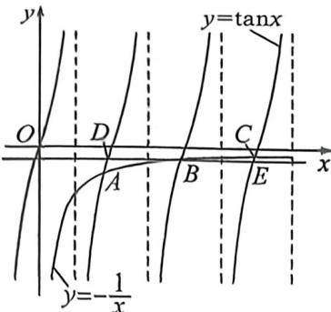

> [!faq]- 例题解析
>
> > [!success]- **【答案】** D
>
> > [!note]- **【解析】**
> > $$
> > \frac {1}{x _ {1}} + \frac {1}{x _ {3}} > \frac {2}{x _ {2}}
> > $$
> >
> > 
> >
> > 解析 由于 AB，由题意知 $f'(x) = -\sin x$ ，则曲线在点 $(x_{1}, \cos x_{1}) (i=1,2,3)$ 处的切线的斜率 $k_{1} = -\sin x_{1}$ ，又 $k_{1} = \frac{\cos x_{1} - 0}{x_{1} - 0} = \frac{\cos x_{1}}{x_{1}}$ ，即 $x_{1} \tan x_{1} = -1$ ，故 A, B 错误；
> > 对于 CD，作函数 $y=\tan x$ 与 $y=-\frac{1}{x}$ 的图象如图，设交点分别为 $A(x_{1},\tan x_{1}), B(x_{2},\tan x_{2}), C(x_{3},\tan x_{3})$ ，过点 B 作 x 轴的平行线与 $y=\tan x(0<x<3\pi)$ 的图象交于 D, E 两点，则 $D(x_{2}-\pi,\tan x_{2}), E(x_{2}+\pi,\tan x_{2})$ ，由 $y=-\frac{1}{x}$ 的函数图象可知 $\tan x_{2}-\tan x_{1}>\tan x_{3}-\tan x_{2}$ ，即 $-\frac{1}{x_{2}}+\frac{1}{x_{1}}>-\frac{1}{x_{3}}+\frac{1}{x_{2}}$ ，所以 $\frac{1}{x_{1}}+\frac{1}{x_{3}}>\frac{2}{x_{2}}$ ，故 C 错误，D 正确。
> >
> > 故选 **D**.
