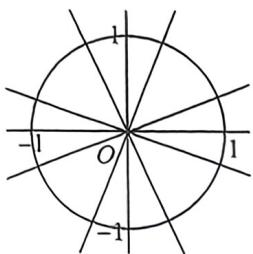
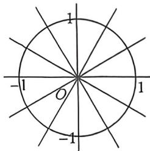

## 考点三_三角不等式与三角最值

## 一、三角不等式与数形结合

![[高中/总复习/二轮/2026版高中《MST新思路思维拓展》二轮复习专题/上册/板块3_三角/考点三_三角不等式与三角最值/questions/Q00092923.md]]
![[高中/总复习/二轮/2026版高中《MST新思路思维拓展》二轮复习专题/上册/板块3_三角/考点三_三角不等式与三角最值/questions/Q00093334.md]]
![[高中/总复习/二轮/2026版高中《MST新思路思维拓展》二轮复习专题/上册/板块3_三角/考点三_三角不等式与三角最值/questions/Q00093157.md]]

## 二、单位圆探路分析

2025 全国Ⅰ卷高考压轴题最佳方案就是利用单位圆来分析,事半功倍。

在常见的最大值的最小值问题中,常采用一种直线逼近思路解题,当然这种思想在三角函数的单位圆中也比较常见:例如求 $f(n)=\sin\left(\frac{n}{c}\pi+\alpha\right),n\in Z,c$ 为偶数时的最大值的最小值问题,由周期性,我们分析每隔 2c 图像重叠个点如图,我们发现左图最大值始终大于右图 2c 个点均匀分布最大值.

所以最大值取最小值必然得保证第一象限最后一个点与第二象限第一个点函数值相等的特殊条件

![[高中/总复习/二轮/2026版高中《MST新思路思维拓展》二轮复习专题/上册/板块3_三角/考点三_三角不等式与三角最值/questions/Q00092928.md]]
![[高中/总复习/二轮/2026版高中《MST新思路思维拓展》二轮复习专题/上册/板块3_三角/考点三_三角不等式与三角最值/questions/Q00093158.md]]
![[高中/总复习/二轮/2026版高中《MST新思路思维拓展》二轮复习专题/上册/板块3_三角/考点三_三角不等式与三角最值/questions/Q00093294.md]]
![[高中/总复习/二轮/2026版高中《MST新思路思维拓展》二轮复习专题/上册/板块3_三角/考点三_三角不等式与三角最值/questions/Q00092931.md]]

## 三、和差积换元法与二次函数构造

![[高中/总复习/二轮/2026版高中《MST新思路思维拓展》二轮复习专题/上册/板块3_三角/考点三_三角不等式与三角最值/questions/Q00093233.md]]
![[高中/总复习/二轮/2026版高中《MST新思路思维拓展》二轮复习专题/上册/板块3_三角/考点三_三角不等式与三角最值/questions/Q00092933.md]]
![[高中/总复习/二轮/2026版高中《MST新思路思维拓展》二轮复习专题/上册/板块3_三角/考点三_三角不等式与三角最值/questions/Q00092934.md]]
![[高中/总复习/二轮/2026版高中《MST新思路思维拓展》二轮复习专题/上册/板块3_三角/考点三_三角不等式与三角最值/questions/Q00092935.md]]

## 例34 (2026届辽宁东北育才学校十月月考T18)已知 $\sin \alpha +\cos \alpha = k.$

(1) 若 $\alpha \in (0, \pi), k = \frac{2}{3}$ , 求 $\tan \alpha$ ;

(2)设 $S_{n} = \sin^{n}\alpha +\cos^{n}\alpha ,n\in \mathbf{N}^{\circ}$ ，证明： $S_{n} = kS_{n - 1} - \frac{k^{2} - 1}{2} S_{n - 2}(n\geqslant 3)$

(3)在(2)的条件下,若 $k=\frac{7}{5}$ , 证明数列 $\{S_{n}-\frac{4}{5}S_{n-1}\}$ 为等比数列并求 $S_{n}$ 的通项公式.

解析 (1) 由题意可得 $\sin \alpha + \cos \alpha = \frac{2}{3}$ , 易得 $1 + 2\sin \alpha \cos \alpha = \frac{4}{9} \Rightarrow \sin \alpha \cos \alpha = -\frac{5}{18}, \tan \alpha < 0$ , 利用齐次化, $(\sin \alpha + \cos \alpha)^2 = \frac{\sin^2 \alpha + 2\sin \alpha \cos \alpha + \cos^2 \alpha}{\sin^2 \alpha + \cos^2 \alpha} = \frac{\tan^2 \alpha + 2\tan \alpha + 1}{\tan^2 \alpha + 1} = \frac{4}{9}$ , 所以 $\tan \alpha = -\frac{9 + 2\sqrt{14}}{5}$ .

(2)证明：因为 $S_{1} = \sin \alpha +\cos \alpha = k,S_{2} = \sin^{2}\alpha +\cos^{2}\alpha = 1$ ，则 $\sin \alpha \cdot \cos \alpha = \frac{(\sin\alpha + \cos\alpha)^2 - (\sin^2\alpha + \cos^2\alpha)}{2} = \frac{k^2 - 1}{2},$ 故 $S_{n} = \sin^{n}\alpha +\cos^{n}\alpha = (\sin \alpha +\cos \alpha)\cdot (\sin^{n - 1}\alpha +\cos^{n - 1}\alpha) - \cos \alpha \cdot \sin^{n - 1}\alpha -\sin \alpha \cdot \cos^{n - 1}\alpha$ $= (\sin \alpha +\cos \alpha)\cdot (\sin^{n - 1}\alpha +\cos^{n - 1}\alpha) - \sin \alpha \cdot \cos \alpha \cdot (\sin^{n - 2}\alpha +\cos^{n - 2}\alpha) = kS_{n - 1} - \frac{k^2 - 1}{2} S_{n - 2},n\geqslant 3.$

(3)证明：由(2)得： $S_{n}=kS_{n-1}-\frac{k^{2}-1}{2}S_{n-2}(n\geqslant3), k=\frac{7}{5}$ 时，有 $S_{n}=\frac{7}{5}S_{n-1}-\frac{12}{25}S_{n-2}, n\geqslant3,$ 则 $S_{n} - \frac{4}{5} S_{n - 1} = \frac{3}{5} S_{n - 1} - \frac{12}{25} S_{n - 2} = \frac{3}{5}\left(S_{n - 1} - \frac{4}{5} S_{n - 2}\right)$ ，又 $S_{1} = \sin \alpha +\cos \alpha = \frac{7}{5},S_{2} = \sin^{2}\alpha +\cos^{2}\alpha = 1,S_{2} - \frac{4}{5} S_{1} = 1-$ $\frac{28}{25} = -\frac{3}{25}\neq 0,$

所以 $\left\{S_{n} - \frac{4}{5} S_{n - 1}\right\}$ 是以 $-\frac{3}{25}$ 为首项， $\frac{3}{5}$ 为公比的等比数列；同理 $S_{n} - \frac{3}{5} S_{n - 1} = \frac{4}{5} S_{n - 1} - \frac{12}{25} S_{n - 2} = \frac{4}{5}\left(S_{n - 1} - \frac{3}{5} S_{n - 2}\right)$ 又 $S_{1} = \sin \alpha +\cos \alpha = \frac{7}{5},S_{2} = \sin^{2}\alpha +\cos^{2}\alpha = 1,S_{2} - \frac{3}{5} S_{1} = 1 - \frac{21}{25} = \frac{4}{25}\neq 0$ ，所以 $\{S_n - \frac{3}{5} S_{n - 1}\}$ 是以 $\frac{4}{25}$ 为首项， $\frac{4}{5}$ 为公比的等比数列；结合等比数列的通项公式，可得： $S_{n} - \frac{4}{5} S_{n - 1} = \frac{-3}{25}\left(\frac{3}{5}\right)^{n - 2},S_{n} - \frac{3}{5} S_{n - 1} = \frac{4}{25}\left(\frac{4}{5}\right)^{n - 2},$

两式作差，得 $S_{n - 1} = \frac{4}{5}\left(\frac{4}{5}\right)^{n - 2} + \frac{3}{5}\left(\frac{3}{5}\right)^{n - 2} = \left(\frac{4}{5}\right)^{n - 1} + \left(\frac{3}{5}\right)^{n - 1}$ （ $n\geqslant 2$ ），故 $S_{n} = \left(\frac{4}{5}\right)^{n} + \left(\frac{3}{5}\right)^{n}$ .
