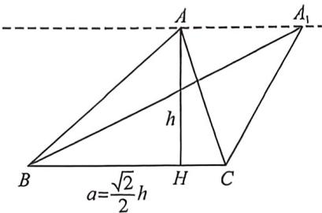

> [!faq]- 例题解析
>
> > [!success]- **【答案】** AD
>
> > [!note]- **【解析】**
> > 解析 法一: 由 $\sqrt{2} \sin A = \sin B \sin C$ 可得 $\sqrt{2} a = b \sin C, \sqrt{2} a = c \sin B$ , 故 $2a^{2} = b \sin C \cdot c \sin B = b c \sin C \sin B = b c \cdot \sqrt{2} \sin A$ , 即 $\sqrt{2} b c \sin A = 2$ ,
> >
> > 对于 A, $S_{\triangle ABC} = \frac{1}{2}bc \sin A = \frac{1}{2} \times \sqrt{2} = \frac{\sqrt{2}}{2}$ , A 正确,
> >
> > 对于B,由于 $S_{\triangle ABC} = \frac{1}{2} a\cdot h = \frac{1}{2}\times 1\times h = \frac{\sqrt{2}}{2}$ ，故 $h = \sqrt{2}$ ，其中 $h$ 为BC边上的高，B错误，
> >
> > 对于 C, 由 $\sqrt{2}\sin A = \sin B\sin C$ 可得 $\sqrt{2}\sin(B+C) = \sin B\sin C$ ,
> >
> > 即 $\sqrt{2}\sin B\cos C + \sqrt{2}\sin C\cos B = \sin B\sin C$ ，故 $\sqrt{2} (\tan B + \tan C) = \tan B\tan C,$
> >
> > 故 $\frac{1}{\tan B} = \frac{\sqrt{2}}{2} -\frac{1}{\tan C}$ ，当 $0 <   \tan C <   \sqrt{2}$ 时， $\tan B <   0$ ，故 $\frac{\sqrt{10}}{10}$ 不是 $\tan B$ 的最小值，故C错误，
> >
> > 对于 $\mathrm{D},\frac{b}{c} +\frac{c}{b} = \frac{b^2 + c^2}{bc},a^2 = c^2 +b^2 -2cb\cos A$ ，故 $\frac{b}{c} +\frac{c}{b} = \frac{a^2 + 2bc\cos A}{bc} = \frac{\sin^2A}{\sin B\sin C} +2\cos A = \frac{\sin^2A}{\sqrt{2}\sin A} +2\cos A = \frac{\sqrt{2}}{2}$ $\sin A + 2\cos A = \frac{3}{\sqrt{2}}\sin (A + \theta)$ ，其中锐角 $\theta$ 满足 $\tan \theta = 2\sqrt{2}$ ，因此 $\frac{b}{c} +\frac{c}{b}$ 的最大值为 $\frac{3}{\sqrt{2}}$ ，即 $\frac{b}{c} +\frac{c}{b}\leqslant \frac{3}{\sqrt{2}}$ 令 $\frac{b}{c} = x,x > 0,$ 则 $x + \frac{1}{x}\leqslant \frac{3}{\sqrt{2}}$ ，故 $\frac{\sqrt{2}}{2}\leqslant x\leqslant \sqrt{2}$ ，因此 $\frac{b}{c}$ 最大值为 $\sqrt{2},\mathrm{D}$ 正确，
> >
> > 
> >
> > 本题是底高比模型， $\sqrt{2}\sin A = \sin B\sin C \Rightarrow \frac{1}{\tan B} + \frac{1}{\tan C} = \frac{\sqrt{2}}{2}$ ，根据数形结合可知 $a = \frac{\sqrt{2}}{2} h$
> >
> > 法二:如图, $\frac{1}{\tan B}+\frac{1}{\tan C}=\frac{|BH|}{h}+\frac{|CH|}{h}=\frac{a}{h}=\frac{\sqrt{2}}{2}$ ,故 $S=\frac{ah}{2}=\frac{\sqrt{2}}{2}$ ,故A正确,B错误;C错误,因为当A在平行于BC的直线上运动, $\tan B$ 没有最小值;对于D,构造阿氏圆,易知A在一个 $\frac{b}{c}=\lambda$ ,且 $r\geqslant\sqrt{2}$ 的阿氏圆上,此时利用半径公式 $|BC|=1=\frac{r}{\lambda-\frac{1}{\lambda}}\Leftrightarrow2\lambda^{2}-\sqrt{2}\lambda-2\leqslant0$ ,此时有 $-\frac{\sqrt{2}}{2}\leqslant\lambda\leqslant\sqrt{2}$ ,D正确,
> >
> > 故选 **AD**.
