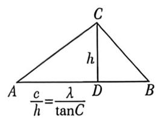
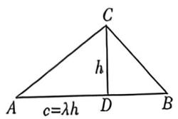
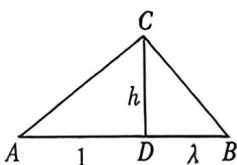
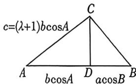

## 考点三_正切定理与万能辅助角

## 一、正切恒等式

任意斜三角形中, $\tan A+\tan B+\tan C=\tan A\cdot\tan B\cdot\tan C$ (正切恒等式)

证明： $-\tan C = \tan (A + B) = \frac{\tan A + \tan B}{1 - \tan A\cdot\tan B}\Leftrightarrow \tan A + \tan B + \tan C = \tan A\cdot \tan B\cdot \tan C$

![[高中/总复习/二轮/2026版高中《MST新思路思维拓展》二轮复习专题/上册/板块3_三角/考点三_正切定理与万能辅助角/questions/Q00093303.md]]
![[高中/总复习/二轮/2026版高中《MST新思路思维拓展》二轮复习专题/上册/板块3_三角/考点三_正切定理与万能辅助角/questions/Q00092983.md]]

## 二、万能辅助角

已知三角形的一个内角 C, 求 $\sin A + \sin B$ 或者 $\sin A + \lambda \sin B$

公式一: $a+b=4R\cos\frac{C}{2}\sin\left(A+\frac{C}{2}\right)$ ,

公式二: $a+\lambda b=2R\sqrt{\lambda^{2}+2\lambda\cos C+1}\sin(B+\varphi)\leqslant2R\sqrt{\lambda^{2}+2\lambda\cos C+1}(\lambda>0)$

证明: $\sin A + \sin B = \sin A + \sin (A + C) = \sin A(1 + \cos C) + \cos A\sin C$

$$
= 2 \sin A \cos^ {2} \frac {C}{2} + 2 \cos A \sin \frac {C}{2} \cos \frac {C}{2} = 2 \cos \frac {C}{2} \left(\sin A \cos \frac {C}{2} + \cos A \sin \frac {C}{2}\right) = 2 \cos \frac {C}{2} \sin \left(A + \frac {C}{2}\right)
$$

故： $a$

$$
+ b = 4 R \cos \frac {C}{2} \sin \left(A + \frac {C}{2}\right)
$$

$$
\sin A + \lambda \sin B = \sin (B + C) + \lambda \sin B = \sin B (\lambda + \cos C) + \cos B \sin C = \sqrt {(\lambda + \cos C) ^ {2} + \sin^ {2} C} \sin (B + \varphi),
$$

中 $\tan \varphi = \frac{\sin C}{\cos C + \lambda}$ 故 $\sin A + \lambda \sin B \leqslant \sqrt{\lambda^2 + 2\lambda \cos C + 1}$

注意: $\sin A+\lambda\sin B=\sin(B+C)+\lambda\sin B=\sin B(\lambda+\cos C)+\cos B\sin C,$

当 $\cos C + \lambda = 0$ 时， $a + \lambda b = 2R[\sin B(\cos C + \lambda) + \cos B\sin C] = 2R \cdot \sin C\cos B,$

注意: 求 $\cos A + \cos B$ 的方法如法炮制.

![[高中/总复习/二轮/2026版高中《MST新思路思维拓展》二轮复习专题/上册/板块3_三角/考点三_正切定理与万能辅助角/questions/Q00092984.md]]
![[高中/总复习/二轮/2026版高中《MST新思路思维拓展》二轮复习专题/上册/板块3_三角/考点三_正切定理与万能辅助角/questions/Q00093169.md]]

## 三、正切倒数和(底高比)定理：

公式一: $\frac{1}{\tan A} + \frac{1}{\tan B} = \frac{\lambda}{\tan C} \Leftrightarrow a^2 + b^2 = \frac{\lambda + 2}{\lambda} c^2$ (注意: $\lambda = \frac{2c^2}{a^2 + b^2 - c^2}$ )

公式二： $\frac{1}{\tan A} +\frac{1}{\tan B} = \lambda \Leftrightarrow S = \frac{c^2}{2\lambda}\Leftrightarrow \sin C = \lambda \sin A\sin B$ ，且 $\frac{b}{a} +\frac{a}{b}\leqslant \sqrt{\lambda^2 + 4};$

【证明】公式一:(充分性)因为 $\frac{1}{\tan A}+\frac{1}{\tan B}=\frac{\lambda}{\tan C}$ ，所以 $\frac{\cos A}{\sin A}+\frac{\cos B}{\sin B}=\frac{\lambda\cos C}{\sin C}$ ，所以

$$
\sin C \sin B \cos A + \sin A \sin C \cos B = \lambda \sin A \sin B \cos C, b c \cos A + a c \cos B = \lambda a b \cos C,
$$

所以 $\frac{b^2 + c^2 - a^2}{2} + \frac{a^2 + c^2 - b^2}{2} = \frac{\lambda}{2} (a^2 + b^2 - c^2)$ ，所以 $a^2 + b^2 = \frac{\lambda + 2}{\lambda} c^2, \lambda = \frac{2c^2}{a^2 + b^2 - c^2}$ . 必要性反向证明即可，但注意 $A, B, C \neq \frac{\pi}{2}$ .

$$
\mathrm{公式二}: \frac {1}{\tan A} + \frac {1}{\tan B} = \lambda \Rightarrow \frac {\cos A}{\sin A} + \frac {\cos B}{\sin B} = \lambda \Rightarrow \sin B \cos A + \cos B \sin A = \sin C = \lambda \sin A \sin B
$$

$$
S = \frac {1}{2} a b \sin C = \frac {1}{2} \sin A \sin B \sin C \cdot 4 R ^ {2} = \frac {1}{2 \lambda} \sin^ {2} C \cdot 4 R ^ {2} = \frac {c ^ {2}}{2 \lambda},
$$

$$
\frac {b}{a} + \frac {a}{b} = \frac {a ^ {2} + b ^ {2}}{a b} = \frac {2 a b \cos C + c ^ {2}}{a b} = 2 \cos C + \frac {\sin^ {2} C}{\sin A \sin B} = 2 \cos C + \lambda \sin C = \sqrt {\lambda^ {2} + 4} \sin (C + \varphi) \leqslant
$$

$\sqrt{\lambda^2 + 4}\left(\text{其中} \tan \varphi = \frac{2}{\lambda}\right)$

几何背景

$$
\frac {1}{\tan A} + \frac {1}{\tan B} = \frac {\lambda}{\tan C} \text {型}
$$

$$
\frac {1}{\tan A} + \frac {1}{\tan B} = \lambda \text {型}
$$

公式一如左图：由于 $\frac{1}{\tan A} +\frac{1}{\tan B} = \frac{|AD|}{h} +\frac{|BD|}{h} = \frac{c}{h} = \frac{\lambda}{\tan C}$ 且 $S = \frac{ch}{2} = \frac{c^2\tan C}{2\lambda} = \frac{1}{4}(a^2 +b^2 -$

$c^{2})\tan C,$

故 $a^{\sharp} + b^{\sharp} - c^{\sharp} = \frac{2c^{\sharp}}{\lambda}$ 即 $a^{\sharp} + b^{\sharp} = \frac{\lambda + 2}{\lambda} c^{\sharp}$

公式二如右图： $\frac{1}{\tan A}+\frac{1}{\tan B}=\frac{|AD|}{h}+\frac{|BD|}{h}=\frac{c}{h}=\lambda$ ，故 $S=\frac{ch}{2}=\frac{c^{2}}{2\lambda}$

$$
\sin A \sin B = \frac {h}{a} \cdot \frac {h}{b} = \frac {h ^ {2}}{\frac {2 S}{\sin C}} = \frac {h ^ {2}}{c h} \sin C = \frac {\sin C}{\lambda}
$$

由于几何背景完全依附于底高比和等面积法,故此定理也叫底高比定理.建议画图理解,加深对模型的理解和记忆.

![[高中/总复习/二轮/2026版高中《MST新思路思维拓展》二轮复习专题/上册/板块3_三角/考点三_正切定理与万能辅助角/questions/Q00093304.md]]
![[高中/总复习/二轮/2026版高中《MST新思路思维拓展》二轮复习专题/上册/板块3_三角/考点三_正切定理与万能辅助角/questions/Q00092988.md]]
![[高中/总复习/二轮/2026版高中《MST新思路思维拓展》二轮复习专题/上册/板块3_三角/考点三_正切定理与万能辅助角/questions/Q00092989.md]]
![[高中/总复习/二轮/2026版高中《MST新思路思维拓展》二轮复习专题/上册/板块3_三角/考点三_正切定理与万能辅助角/questions/Q00092990.md]]

## 四、正切比值(射影比值)定理

$$
\tan A = \lambda \tan B \Leftrightarrow c = (\lambda + 1) b \cos A \Leftrightarrow \frac {a ^ {2} - b ^ {2}}{\lambda - 1} = \frac {c ^ {2}}{\lambda + 1} (\lambda \neq 0).
$$

证明:(充分性)因为 $\tan A=\lambda\tan B$ , 所以 $\frac{\sin A}{\cos A}=\lambda\frac{\sin B}{\cos B}$ , 所以 $\sin A\cos B=\lambda\sin B\cos A$ ,

即 $\sin A\cos B + \sin B\cos A = (\lambda +1)\sin B\cos A$ ，故 $\sin (A + B) = \sin C = (\lambda +1)\sin B\cos A,c = (\lambda +1)b\cos A.$

根据余弦定理， $c = (\lambda +1)b\frac{b^2 + c^2 - a^2}{2bc}$ 故 $(\lambda +1)(b^{2} - a^{2}) + (\lambda -1)c^{2} = 0$ ，即 $\frac{a^2 - b^2}{\lambda - 1} = \frac{c^2}{\lambda + 1},$

必要性反推即可,这里不详细说明.

几何背景

如下左图: CD 为 AB 边上的高, 且 $\overrightarrow{BD} = \lambda \overrightarrow{DA}$ , 则 $\tan A = \frac{h}{|AD|} = \lambda \frac{h}{|BD|} = \lambda \tan B$ ;

由于 $|AD|=b\cos A,|BD|=a\cos B=\lambda b\cos A$ ，所以 $c=|AD|+|BD|=(\lambda+1)b\cos A;$

由于 $a^2 - b^2 = |BD|^2 - |AD|^2 = (\lambda^2 - 1)|AD|^2$ ，且 $c^2 = (1 + \lambda)^2 |AD|^2$ ，所以 $\frac{a^2 - b^2}{\lambda - 1} = \frac{c^2}{\lambda + 1}$

所以,正切的比值定理也叫射影比值定理.建议大家画图记忆,以便考场中随时推导.

注意 当 $\lambda = 1$ 时, 即我们上一讲介绍到的 $c = 2b\cos A \Leftrightarrow \sin C = 2\sin B\cos A$ , 就是等腰三角形; 当 $\lambda = 0$ 时, $c = b\cos A \Leftrightarrow \sin C = \sin B\cos A \Leftrightarrow \cos B = 0$ , 是直角三角形, 由于直角无正切值, 故 $\lambda \neq 0$ .

![[高中/总复习/二轮/2026版高中《MST新思路思维拓展》二轮复习专题/上册/板块3_三角/考点三_正切定理与万能辅助角/questions/Q00093170.md]]
