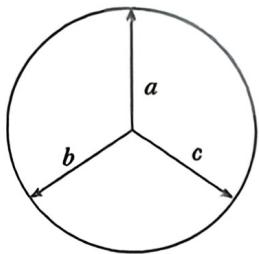

> [!faq]- 例题解析
>
> > [!success]- **【答案】** CD
>
> > [!note]- **【解析】**
> > 解析 对于 A, 若 a, b, c 均为单位向量, 且两两夹角为 $\frac{2\pi}{3}$ , 则 $b+c$ 与 a 反向, 则 $a \otimes (b+c) = |a| \cdot |b+c| \sin \pi = 0$ , $a \otimes b = |a| \cdot |b| \cdot \sin \frac{2\pi}{3} = \frac{\sqrt{3}}{2}$ , $a \otimes c = |a| \cdot |c| \cdot \sin \frac{2\pi}{3} = \frac{\sqrt{3}}{2}$ , 此时不满足 $a \otimes (b+c) = a \otimes b + a \otimes c$ , 故 A 错误; 对于 B, 若 $a = (1, 2)$ , $b = (-2, -1)$ , 则 $\cos a, b = \frac{a \cdot b}{|a| \cdot |b|} = \frac{-2 - 2}{\sqrt{5} \times \sqrt{5}} = -\frac{4}{5}$ , 因 $a, b \in [0, \pi]$ , 则 $\sin a, b = \frac{3}{5}$ ,
> >
> > 则 $a \otimes b = |a| \cdot |b| \cdot \sin a, b = \sqrt{5} \times \sqrt{5} \times \frac{3}{5} = 3 \neq 2$ ，故B错误；
> >
> > 对于 C, 若 $a=(x_{1},y_{1})$ , $b=(x_{2},y_{2})$ , 则 $\cos\langle a,b\rangle=\frac{a\cdot b}{|a|\cdot|b|}=\frac{x_{1}x_{2}+y_{1}y_{2}}{\sqrt{x_{1}^{2}+y_{1}^{2}}\times\sqrt{x_{2}^{2}+y_{2}^{2}}}$ , 因 a,
> >
> > $b \in [0, \pi]$ , 则 $\sin(a, b) = \sqrt{1 - \left(\frac{x_1 x_2 + y_1 y_2}{\sqrt{x_1^2 + y_1^2} \times \sqrt{x_2^2 + y_2^2}}\right)^2} = \sqrt{\frac{(x_1 y_2 - x_2 y_1)^2}{(x_1^2 + y_1^2)(x_2^2 + y_2^2)}}$ , 则 $a \otimes b =$
> >
> > 
> >
> > $|a|\cdot|b|\cdot\sin\theta=\sqrt{x_{1}^{2}+y_{1}^{2}}\times\sqrt{x_{2}^{2}+y_{2}^{2}}\times\sqrt{\frac{(x_{1}y_{2}-x_{2}y_{1})^{2}}{(x_{1}^{2}+y_{1}^{2})(x_{2}^{2}+y_{2}^{2})}}=|x_{1}y_{2}-x_{2}y_{1}|$ ，故C正确；
> >
> > 对于 D, 因 $a \otimes b = |a| \cdot |b| \cdot \sin a, b = 2\sqrt{2}, a \cdot b = |a| \cdot |b| \cdot \cos a, b = 1$ , 则 $\tan a, b = 2\sqrt{2}$ , 因 $a, b \in [0, \pi]$ , 则 $\cos (a, b) = \frac{1}{3}$ , 则 $|a| \cdot |b| = 3$ , 则 $|a + 2b| = \sqrt{(a + 2b)^2} = \sqrt{a^2 + 4a \cdot b + 4b^2} = \sqrt{|a|^2 + 4|b|^2 + 4} \geqslant \sqrt{4|a| \cdot |b| + 4} = 4$ ,
> >
> > 等号成立时 $|a| = 2|b| = \sqrt{6}$ ，则 $|a + 2b|$ 的最小值为4，故D正确.
> >
> > 故选 **CD**.
