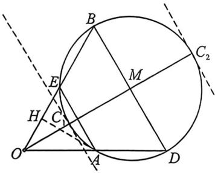
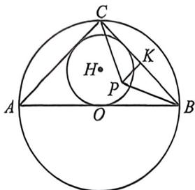

> [!faq]- 例题解析
>
> > [!success]- **【答案】** ACD
>
> > [!note]- **【解析】**
> > 对于 B, 不妨设 $\overrightarrow{OA}=a, \overrightarrow{OB}=b, \overrightarrow{OC}=c$ , 以 O 为坐标原点, OA 所在直线为 x 轴建立平面直角坐标系,
> >
> > 由于 $|a| = 1, |b| = 2, \cos a, b = \frac{1}{2}$ , 可得 $A(1,0), B(1,\sqrt{3})$ , 设 $C(x,y)$ , 则 $a = (1,0), b = (1,\sqrt{3}), c = (x,y)$ ,
> >
> > 由 $\left(\frac{1}{2} c - a\right) \cdot (c - b) = 0$ ，得 $\left(\frac{x}{2} - 1\right)(x - 1) + \frac{y}{2}(y - \sqrt{3}) = 0$ ，即 $\frac{x^2}{2} - \frac{3x}{2} + 1 + \frac{y^2}{2} - \frac{\sqrt{3}}{2} y = 0$ ，即 $\left(x - \frac{3}{2}\right)^2 + \left(y - \frac{\sqrt{3}}{2}\right)^2 = 1$ ，即 $c$ 的终点 $C(x, y)$ 位于以 $\left(\frac{3}{2}, \frac{\sqrt{3}}{2}\right)$ 为圆心，1为半径的圆上，设 $\left(\frac{3}{2}, \frac{\sqrt{3}}{2}\right)$ 为 $D$ ，则 $|OD| = \sqrt{\left(\frac{3}{2}\right)^2 + \left(\frac{\sqrt{3}}{2}\right)^2} = \sqrt{3}$ ，故 $\sqrt{3} - 1 \leqslant |OC| \leqslant \sqrt{3} + 1$ ，即 $\sqrt{3} - 1 \leqslant |c| \leqslant \sqrt{3} + 1$ ，B错误；
> >
> >
> > 对于 C, 由 $\left(x-\frac{3}{2}\right)^{2}+\left(y-\frac{\sqrt{3}}{2}\right)^{2}=1$ 可知 $\frac{3}{2}-1\leqslant x\leqslant\frac{3}{2}+1$ , 即 $\frac{1}{2}\leqslant x\leqslant\frac{5}{2}$ , 而 $a\cdot c=x$ , 故 $a\cdot c$ 的最小值为 $\frac{1}{2}$ 。C 正确;
> >
> > 对于D，由 $c = ma + \frac{1}{2} nb$ ，得 $(x,y) = m(1,0) + \frac{1}{2} n(1,\sqrt{3})$ ，故 $\left\{ \begin{array}{l}x = m + \frac{1}{2} n\\ y = \frac{\sqrt{3}n}{2} \end{array} \right.$ ，可得 $m + n = x + \frac{\sqrt{3}}{3} y,$
> >
> > 而 $(x, y)$ 在圆 $\left(x - \frac{3}{2}\right)^2 + \left(y - \frac{\sqrt{3}}{2}\right)^2 = 1$ 上，设 $x = \frac{3}{2} + \cos \theta, y = \frac{\sqrt{3}}{2} + \sin \theta, \theta \in [0, 2\pi]$ ，则 $m + n = \frac{\sqrt{3}}{3} \sin \theta + \cos \theta + 2 = \frac{2\sqrt{3}}{3} \sin \left(\theta + \frac{\pi}{3}\right) + 2$ ，当 $\sin \left(\theta + \frac{\pi}{3}\right) = -1$ 即 $\theta = \frac{7\pi}{6}$ 时， $m + n$ 取到最小值 $-\frac{2\sqrt{3}}{3} + 2$
> >
> > 当 $\sin \left(\theta +\frac{\pi}{3}\right) = 1$ 即 $\theta = \frac{\pi}{6}$ 时， $m + n$ 取到最大值 $\frac{2\sqrt{3}}{3} +2$ ，故 $m + n$ 的取值范围 $\left[2 - \frac{2\sqrt{3}}{3},2 + \frac{2\sqrt{3}}{3}\right],\mathrm{D}$ 正确.
> >
> > 
> >
> > 法二:如上图,作 $a=|OA|=1, b=|OB|=2, \angle AOB=60^{\circ}$ , 过点 A 作 $AH \perp OB$ 于 H, 所以 $\overrightarrow{OH}$ 即为 a 在 b 上的投影向量, $|OH|=|OA|\cos60^{\circ}=\frac{1}{2}=\frac{1}{4}b$ , A 正确;
> >
> > 延长 $OA$ 至 $D$ , 并使得 $\overrightarrow{OA} = \overrightarrow{AD}, \left(\frac{1}{2} c - a\right) \cdot (c - b) = \frac{1}{2} (c - 2a) \cdot (c - b) = 0$ , 所以 $C$ 在以 $BD$ 为直径的圆上, 取 $BD$ 中点 $M$ , 即 $C$ 在以 $M$ 为圆心, 1 为半径的圆上, 由于 $OBD$ 为等边三角形, 故 $|\overrightarrow{OC_1}| \leqslant |c| \leqslant |\overrightarrow{OC_2}|$ , 如图所示, 由于 $|OM| = \sqrt{3}$ , 所以 $\sqrt{3} - 1 \leqslant |c| \leqslant \sqrt{3} + 1$ , B 错误;
> >
> > 如图, $a\cdot c\geqslant\overrightarrow{OA}\cdot\overrightarrow{OE}$ ，其中E为圆的左顶点，也是OB中点，此时 $\overrightarrow{OE}$ 在 $\overrightarrow{OA}$ 上投影取得的最小值 $\frac{1}{2}$ ，故 $a\cdot c$ 的最小值为 $\frac{1}{2}$ ，C正确；
> >
> > 利用等和线, $c=ma+\frac{1}{2}nb=m\overrightarrow{OA}+n\overrightarrow{OE}$ ，取AB中点N,m+n∈ $\left[\frac{|ON|}{|OC_{1}|},\frac{|ON|}{|OC_{2}|}\right]=\left[\frac{\frac{\sqrt{3}}{2},\frac{\sqrt{3}}{2}}{\sqrt{3}-1},\frac{\sqrt{3}}{\sqrt{3}+1}\right]$ ，D正确.故选:ACD.
> >
> > 例B (2026届广西钦州八月联考T14) $\triangle ABC$ 中, $AB = \sqrt{2}$ , 点 $P$ 为 $\triangle ABC$ 平面内一点, 且 $\overrightarrow{PB} \cdot \overrightarrow{BC} = -\frac{1}{2}, \overrightarrow{PC} \cdot \overrightarrow{BC} = \frac{1}{2}, O, H$ 分别为 $\triangle ABC$ 的外心和内心, 当 $\tan \angle BAC$ 的值最大时, $OH$ 的长度为 \_\_\_\_.
> >
> > 
> >
> > 由 $\overrightarrow{PB} \cdot \overrightarrow{BC} = -\frac{1}{2}, \overrightarrow{PC} \cdot \overrightarrow{BC} = \frac{1}{2}$ , 可得 $(\overrightarrow{PB} + \overrightarrow{PC}) \cdot \overrightarrow{BC} = -\frac{1}{2} + \frac{1}{2} = 0$ , 所以 $P$ 在 $BC$ 的垂直平分线上. 设 $K$ 为 $BC$ 的中点, 可得 $\overrightarrow{PB} \cdot \overrightarrow{BC} = (\overrightarrow{PK} + \overrightarrow{KB}) \cdot 2\overrightarrow{BK} = -\frac{1}{2} \Rightarrow 2\overrightarrow{BK}^2 = \frac{1}{2}$ , 所以 $BK = \frac{1}{2}$ , 从而 $BC = 1$ . 由正弦定理可得 $\frac{BC}{\sin\angle BAC} = \frac{AB}{\sin\angle ACB}$ , 所以 $\sin\angle BAC = \frac{BC \times \sin\angle ACB}{AB} = \frac{\sqrt{2}}{2}\sin\angle ACB$ , 当 $\sin\angle ACB = 1, (\sin\angle BAC)_{\max} = \frac{\sqrt{2}}{2}$ , 要使 $\tan\angle BAC$ 值最大时, 则 $\angle BAC$ 为锐角, 所以 $\angle BAC = \frac{\pi}{4}$ , 从而 $\triangle ABC$ 为等腰直角三角形, 所以 $AC = 1$ . 所以 $O, H$ 均在斜边 $AB$ 的垂直平分线上, 即 $OH$ 为内切圆的半径, 设内切圆半径为 $r$ , 则 $\frac{1}{2}(AC + BC + AB) \cdot r = \frac{1}{2}AC \cdot BC$ , 即 $\frac{1}{2}(1 + 1 + \sqrt{2}) \cdot r = \frac{1}{2}$ , 解得 $r = \frac{1}{2 + \sqrt{2}} = \frac{2 - \sqrt{2}}{2}$ , 即 $OH = \frac{2 - \sqrt{2}}{2}$ . 故答案为: $\frac{2 - \sqrt{2}}{2}$
