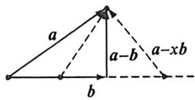
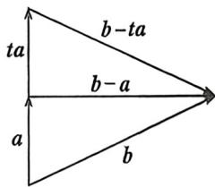

## 考点二_向量的几何背景分析

## 一、隐藏的垂直

定义: 若向量 a, b, c, 满足 $\left|a - xb\right| \geqslant \left|a - b\right|$ , 则 $(a - b) \perp b$ ; $\left|a - xc\right| \geqslant \left|a - c\right|$ , 则 $(a - c) \perp c$ ;

<!-- source-part:3 pages:101-150 -->

证明:我们以 $|a-xb|\geqslant|a-b|$ 为例,如图,以相同起点作出a,b,显然当 $|a-xb|\geqslant|a-b|$ 时,根据斜边大于直角边,故当且仅当 $(a-b)\perp b$ 时成立.

记忆口诀： $|a - xb| \geqslant |a - b| \Leftrightarrow |b| \perp |a - b|$ ，同型含 x 项与后面垂直！

例(10) (2026届·河北保定十校九月质检 T14)已知向量 a, b 满足 $\left|b\right|=6\sqrt{2}$ ，且对任意的 $t\in R$ ，都有 $\left|b-a\right|\geqslant\left|b-a\right|$ ，则 $\left|a-b\right|+\left|a\right|$ 的最大值是 \_\_\_\_。

解析 因为对任意 $t \in \mathbb{R}$ , 都有 $|b - ta| \geqslant |b - a|$ , 如图, 由图可知, $(b - a) \perp a$ , 设 $b$ 与 $b - a$ 夹角为 $\theta$ , 所以 $|a - b| + |a| = 6\sqrt{2} (\sin \theta + \cos \theta) = 12 \sin \left( \theta + \frac{\pi}{4} \right) \leqslant 12$ , 当且仅当 $\theta = \frac{\pi}{4}$ 时取等号, 所以 $|a - b| + |a|$ 的最大值是 12. 故答案为: 12

## 二、隐藏的圆与向量投影

定理:若向量 a, b, c 满足 $(a - c) \cdot (b - c) = 0$ ，则 c 在以 a - b 为直径的圆上.

![[高中/总复习/二轮/2026版高中《MST新思路思维拓展》二轮复习专题/上册/板块3_三角/考点二_向量的几何背景分析/questions/Q00093235.md]]

## 三、向量的叉乘

向量叉乘(面积计算式推导): $a \otimes b = |a| \cdot |b| \cdot \sin\theta = \sqrt{x_{1}^{2} + y_{1}^{2}} \times \sqrt{x_{2}^{2} + y_{2}^{2}} \times \sqrt{\frac{(x_{1}y_{2} - x_{2}y_{1})^{2}}{(x_{1}^{2} + y_{1}^{2})(x_{2}^{2} + y_{2}^{2})}} = |x_{1}y_{2} - x_{2}y_{1}|$

$$
S = \frac {1}{2} | \boldsymbol {a} | \cdot | \boldsymbol {b} | \cdot \sin \theta = \frac {1}{2} | x _ {1} y _ {2} - x _ {2} y _ {1} |
$$

![[高中/总复习/二轮/2026版高中《MST新思路思维拓展》二轮复习专题/上册/板块3_三角/考点二_向量的几何背景分析/questions/Q00092956.md]]

## 四、向量运算与数列递推

![[高中/总复习/二轮/2026版高中《MST新思路思维拓展》二轮复习专题/上册/板块3_三角/考点二_向量的几何背景分析/questions/Q00093336.md]]
