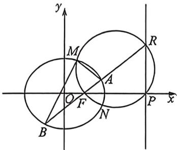
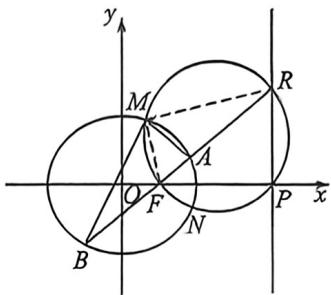

> [!faq]- 例题解析
>
> > [!success]- **【答案】** 详见解析
>
> > [!note]- **【解析】**
> > 解析 (1) 由题知, $AB = \frac{2b^2}{a} = 3$ , 又 $a^2 = b^2 + 1$ , 解得 $a = 2$ . 故椭圆 $C$ 的方程为 $\frac{x^2}{4} + \frac{y^2}{3} = 1$ .
> >
> > (2)（|）设 $A(x_{1},y_{1}),B(x_{2},y_{2}),P(4,0),F(1,0)$ ，令 $\overrightarrow{AF} = \lambda \overrightarrow{FB}$ ，存在点 $R$ ，使 $\overrightarrow{AR} = -\lambda \overrightarrow{RB},\left\{ \begin{array}{l}\frac{x_1^2}{4} +\frac{y_1^2}{3} = 1\\ \frac{\lambda^2x_2^2}{4} +\frac{\lambda y_2^2}{4} = \lambda^2 \end{array} \right.$ 两式相减， $\frac{(x_1 + \lambda x_2)(x_1 - \lambda x_1)}{(1 + \lambda)(1 - \lambda)} +\frac{(y_1 + \lambda y_2)(y_1 - \lambda y_2)}{(1 + \lambda)(1 - \lambda)} = 1$ ，因为 $\left\{ \begin{array}{l}x_F = \frac{x_1 + \lambda x_2}{1 + \lambda} = 1\\ y_F = \frac{y_1 + \lambda y_2}{1 + \lambda} = 0 \end{array} ,\left\{ \begin{array}{l}x_R = \frac{x_1 - \lambda x_2}{1 - \lambda}\\ y_R = \frac{y_1 - \lambda y_2}{1 - \lambda} \end{array} \right.\right.$ 所以 $x_{F}x_{R} = 4$ ，所以 $x_{R} = 4,\left\{ \begin{array}{l}x_{1} = \frac{5}{2} -\frac{3}{2}\lambda \\ x_{2} = \frac{5}{2} -\frac{3}{2\lambda}\\ y_{1} + \lambda y_{2} = 0 \end{array} \right.$ 所以 $\tan \angle APF = \frac{-y_1}{x_1 - 4} = \frac{-y_1}{-\frac{3}{2} -\frac{3}{2}\lambda} = \frac{y_1}{\frac{3}{2} + \frac{3}{2}\lambda}$ 所以 $\tan \angle BPF = \frac{y_2}{x_2 - 4} = \frac{\frac{y_1}{-\lambda}}{-\frac{3}{2} -\frac{3}{2\lambda}} =$ $\frac{\frac{y_1}{3}}{\frac{3}{2}\lambda + \frac{3}{2}}$ ，所以∠APF=∠BPF.
> >
> > (Ⅱ)因为 $MF$ 为 $\angle AMB$ 内角平分线, 所以 $\frac{AM}{MB} = \frac{AF}{FB} = \lambda$ , 所以 $\frac{AR}{RB} = \frac{AF}{FB} = \frac{AM}{MB}$ , 所以 $MR$ 为 $\angle AMB$ 外角平分线, 所以 $\angle FMR = 90^\circ$ , $M$ 在以 $FR$ 为直径的圆上, 又因为 $\angle FPR = 90^\circ$ , 所以 $M, F, P, R$ 四点共圆. 因为 $\frac{1}{|NA|} + \frac{1}{|NB|} = \frac{\sqrt{3}}{|NF|}$ , 且 $\angle ANF = \angle BNF$ . 根据张角定理: $\cos \angle ANF = \frac{1}{2} \left( \frac{NF}{NA} + \frac{NF}{NB} \right) = \frac{\sqrt{3}}{2}$ , 所以 $\angle ANF = 30^\circ$ , 所以 $\angle ANB = 60^\circ$ , $\cos \angle ANB = \frac{1}{2}$ . 注意: 张角定理证明过程考试要完善, 具体过程大家参考本章前文.
> >
> > 
> >
> > 
> >
> > 2025 永州二模 T19, 2025 山东济南高三质检 T18, 都是相同的阿氏圆命题背景, 这说明压轴题的逻辑更多在于解读逻辑, 而非强哥硬解。
