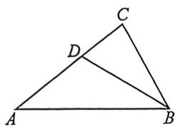
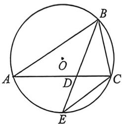

> [!faq]- 例题解析
>
> > [!success]- **【答案】** AD
>
> > [!note]- **【解析】**
> > 解析 (1) 因为 $4a \sin A = b \sin C \cos A + c \sin A \cos B$ , 所以由正弦定理得 $4 \sin^{2} A = \sin B \sin C \cos A + \sin C \sin A \cos B = \sin C (\sin B \cos A + \sin A \cos B) = \sin C \sin (A + B) = \sin^{2} C$ ,
> >
> > 因为 $A, C \in (0, \pi)$ , 所以 $\sin A > 0, \sin C > 0$ , 故 $\frac{\sin A}{\sin C} = \frac{1}{2}$ ;
> >
> > (2)(1)法一(强哥硬证): 证明: $\triangle ABD$ 中, 由正弦定理得 $\frac{AD}{\sin\angle ABD} = \frac{AB}{\sin\angle ADB}$ ①, 同理在 $\triangle BCD$ 中, $\frac{CD}{\sin\angle CBD} = \frac{BC}{\sin\angle CDB}$ ②, $BD$ 是 $\angle ABC$ 的角平分线, 则 $\angle ABD = \angle CBD$ , 则 $\sin\angle ABD = \sin\angle CBD$ ,
> >
> >
> > 故①÷②得 $\frac{AD}{CD}=\frac{AB}{BC}$ ,由比例的性质得 $\frac{AD}{AC}=\frac{AB}{AB+BC}$ ,即 $AD=\frac{AB\cdot AC}{AB+BC}$ ,同理得 $\frac{CD}{AC}=\frac{BC}{AB+BC}$ ,即 $CD=\frac{BC\cdot AC}{AB+BC}$ ,在 $\triangle ABD$ 中,由余弦定理得 $AB^{2}=AD^{2}+BD^{2}-2AD\cdot BD\cdot\cos\angle ADB$ ③, $\triangle BCD$ 中,由余弦定理得 $BC^{2}=CD^{2}+BD^{2}-2CD\cdot BD\cdot\cos\angle CDB$ ④,又 $\angle ADB+\angle CDB=\pi$ ,故 $\sin\angle ADB=\sin\angle CDB,\cos\angle ADB+\cos\angle CDB=0$ ,由 $CD\times③+AD\times④$ 得 $CD\cdot AB^{2}+AD\cdot BC^{2}=CD\cdot AD(AD+CD)+(CD+AD)\cdot BD^{2}=CD\cdot AD\cdot AC+AC\cdot BD^{2}$ ,
> >
> > 则 $BD^{2} = \frac{CD\cdot AB^{2} + AD\cdot BC^{2}}{AC} - CD\cdot AD = \frac{BC\cdot AB^{2} + AB\cdot BC^{2}}{AB + BC} - CD\cdot AD = BA\cdot BC - DA\cdot DC,$ 即 $BD^{2} = BA$ $\cdot BC - DA\cdot DC;$
> >
> > 
> >
> > 
> >
> > 法二(构造外接圆):如图,延长BD交△ABC外接圆于E,因为∠ABD=∠CBD,∠A=∠E,所以△ABD\~△EBC,所以 $\frac{AB}{BE}=\frac{BD}{BC}\Rightarrow BA\cdot BC=BD\cdot BE①$ ,利用圆幂定理可知 $AD\cdot DC=BD\cdot DE②$ ,所以由①②得:
> >
> > $$
> > B A \cdot B C - A D \cdot D C = B D \cdot B E - B D \cdot D E = B D ^ {2};
> > $$
> >
> > (ii) 因为 $\frac{\sin A}{\sin C} = \frac{1}{2}$ , 故 $c = 2a$ , 则 $\frac{AD}{CD} = \frac{AB}{BC} = 2$ , 则 $AD = \frac{2}{3}AC, DC = \frac{1}{3}AC$ , 由 $a = 1$ 以及 (i) 知 $BD^2 = 2 - \frac{2}{9}AC^2$ , 即 $BD^2 + \frac{2}{9}AC^2 = 2$ , 则 $BD^2 + \frac{2}{9}AC^2 \geqslant \frac{2\sqrt{2}}{3}BD \cdot AC$ , 当且仅当 $BD^2 = \frac{2}{9}AC^2$ , 结合 $BD^2 + \frac{2}{9}AC^2 = 2$ , 即 $BD = 1, AC = \frac{3\sqrt{2}}{2}$ 时等号成立, 故 $BD \cdot AC$ 的最大值为 $\frac{3\sqrt{2}}{2}$ .
