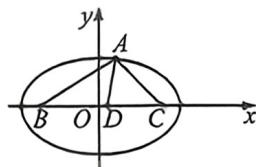

> [!faq]- 例题解析
>
> > [!success]- **【答案】** $4, \frac{2\sqrt{3}}{3}$
>
> > [!note]- **【解析】**
> > 因为 $a = BD + CD = \lambda (b + c) = 4\lambda$ ，所以在 $\triangle ABC$ 中，由余弦定理可得 $16\lambda^2 = a^2 = b^2 +c^2 +bc = (b + c)^2 -bc = 16 - bc,$ 即 $bc = 16 - 16\lambda^2$
> >
> > 故 $\frac{1}{BD} + \frac{1}{DC} = \frac{1}{\lambda c} + \frac{1}{\lambda b} = \frac{4}{\lambda bc} = \frac{4}{\lambda (16 - 16\lambda^2)} = \frac{1}{4\lambda (1 - \lambda^2)}$ ，令 $f(\lambda) = \lambda (1 - \lambda^2), \lambda \in \left[\frac{\sqrt{3}}{2}, 1\right)$ ，则 $f'(\lambda) = 1 - 3\lambda^2, \lambda \in \left[\frac{\sqrt{3}}{2}, 1\right)$ . 当 $\lambda \in \left[\frac{\sqrt{3}}{2}, 1\right)$ 时， $\lambda^2 \in \left[\frac{3}{4}, 1\right)$ ，所以 $3\lambda^2 \in \left[\frac{9}{4}, 3\right)$ ，所以 $1 - 3\lambda^2 \in \left(-2, -\frac{5}{4}\right)$ ，即 $f'(\lambda) < 0$ ，所以函数 $f(\lambda)$ 在区间 $\left[\frac{\sqrt{3}}{2}, 1\right)$ 上单调递减，函数 $f(\lambda)$ 在 $\lambda = \frac{\sqrt{3}}{2}$ 处取得最大值，最大值为 $f\left(\frac{\sqrt{3}}{2}\right) = \frac{\sqrt{3}}{8}$ . 所以当 $\lambda = \frac{\sqrt{3}}{2}$ ，即 $\sin \theta = 1$ ，即 $AD \perp BC$ ，即 $\triangle ABC$ 是等腰三角形时， $\frac{1}{BD} + \frac{1}{DC}$ 取得最小值，最小值为 $\frac{2\sqrt{3}}{3}$ .
> >
> > 法二:利用角平分线张角定理可知: $\cos\frac{\pi}{3}=\frac{1}{2}\left(\frac{AD}{AB}+\frac{AD}{AC}\right)\Leftrightarrow\frac{AB\cdot AC}{AD}=(AB+AC)=4,$
> >
> > 
> >
> > 如图, 将 $\triangle ABC$ 放入以长轴为 4 的椭圆内, 且 $B、C$ 为两个焦点, 由于 $\angle BAC = 120^{\circ}$ , 则 $e \geqslant \sin 60^{\circ} = \frac{\sqrt{3}}{2}$ , 当且仅当 $A$ 为上下顶点时取等, 故 $2\sqrt{3} \leqslant |BC| < 4$ , 利用柯西不等式可知
> >
> > $(BD + DC)\left(\frac{1}{BD} + \frac{1}{DC}\right) \geqslant 4$ ，当且仅当 $A$ 在椭圆上下顶点时，此时 $BD = DC$ 成立， $\frac{1}{BD} + \frac{1}{DC} \geqslant \frac{2\sqrt{3}}{3}$ ；故答案为： $4, \frac{2\sqrt{3}}{3}$ .
