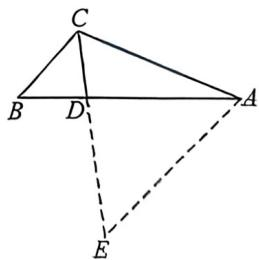
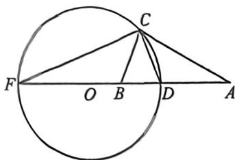

> [!faq]- 例题解析
>
> > [!success]- **【答案】** ABD
>
> > [!note]- **【解析】**
> > $AD = 2DB$ ，过点 $A$ 作 $AE$ 平行于 $BC$ 交 $CD$ 延长线于点 $E$ ，根据平行可得 $\triangle BCD\sim \triangle AED,$ 即 $\frac{AE}{BC} = \frac{AD}{DB} = 2$ ，所以 $AE = 2BC = 2a$ ，又因为 $b = 2a$ ，所以 $AE = AC$ ，即 $\angle ACE = \angle E$ ，根据平行可知 $\angle BCD = \angle E$ ，所以 $\angle ACE = \angle BCD$ ，即 $CD$ 平分 $\angle ACB$ ，故A正确；
> >
> > 
> >
> > 对于BCD, 法一; 由余弦定理得: $\cos A = \frac{b^2 + c^2 - a^2}{2bc} = \frac{3a^2 + 9}{12a} = \frac{a^2 + 3}{4a} \geqslant \frac{2\sqrt{a^2 \cdot 3}}{4a} = \frac{\sqrt{3}}{2}$ , 因为 $A \in (0, \pi)$ , 所以 $A \leqslant \frac{\pi}{6}$ , 故C错误;
> >
> > 由三角形面积公式可得： $S=\frac{1}{2}bc\sin A=\frac{1}{2}\times2a\times3\sqrt{1-\left(\frac{a^{2}+3}{4a}\right)^{2}}=3a\frac{\sqrt{16a^{2}-a^{4}-6a^{2}-9}}{4a}=\frac{3}{4}\sqrt{-a^{4}+10a^{2}-9}$ $= \frac{3}{4}\sqrt{-(a^2 - 5)^2 + 16} \leqslant 3$ ，取等号条件为 $a = \sqrt{5}, b = 2\sqrt{5}$ ，此时满足三角形的两边之和大于第三边，即 $\sqrt{5} + 3 > 2\sqrt{5}$ ，故 B 正确；
> >
> > 再由余弦定理得： $CD^{2} = b^{2} + \left(\frac{2}{3} c\right)^{2} - 2b\cdot \frac{2}{3} c\cdot \cos A = 4a^{2} + 4 - 8a\times \frac{a^{2} + 3}{4a} = 2a^{2} -$ $2 = 2BC^2 -2$
> >
> > 所以 $2BC^{2}=CD^{2}+2$ ，故 D 正确；
> >
> > 
> >
> > 法二:由于 $|AB|=3$ , 且 $\sin B=2\sin A \Rightarrow b=2a$ , 故 $C$ 在一个阿氏圆上, 圆心为 $O$ , 则一定有 $r=\frac{|AB|}{\lambda-\frac{1}{\lambda}}=2$ , 且 $r^{2}=|OA|\cdot|OB|\Rightarrow|OB|=1$ , 所以 $S=\frac{ch}{2}\leqslant\frac{cr}{2}=3$ , B 正确, 由于 $\frac{|OC|}{|OA|}=\frac{1}{2}\leqslant\cos A$ , 当且仅当 $AC$ 与圆相切时取得最大值, 故 $A\leqslant30^{\circ}$ , C 错误; 根据阿氏圆定义可知, $DF$ 为直径时, 则 $CD$ 为 $\angle ABC$ 内角平分线, $CF$ 则为 $\angle ABC$ 外角平分线, 设 $\angle CDF=\theta$ , $|CD|=4\cos\theta$ , $CD^{2}+2=16\cos^{2}\theta+2$ , $|BC|^{2}=|BD|^{2}+|CD|^{2}-2|BD|\cdot|CD|\cos\theta=1+16\cos^{2}\theta-8\cos^{2}\theta=1+8\cos^{2}\theta$ , 所以 $2BC^{2}=CD^{2}+2$ , D 正确;
> >
> > 故选 **ABD**.
