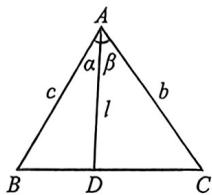
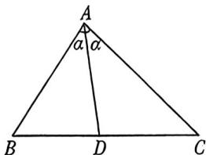
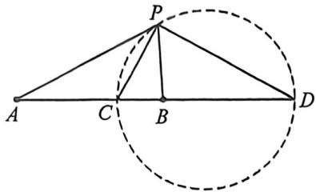
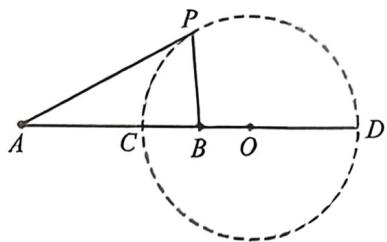
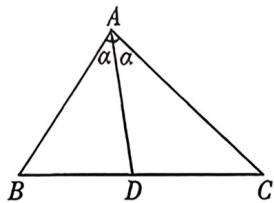

## 考点二_角平分线处理方法

## 一、张角定理

## 1. 张角定理

如图, 在 $\triangle ABC$ 中, $D$ 为 $BC$ 边上的一点, 连接 $AD$ , 设 $AD = l$ , $\angle BAD = \alpha$ , $\angle CAD = \beta$ , 则一定有 $\frac{\sin (\alpha + \beta)}{l} = \frac{\sin \alpha}{b} + \frac{\sin \beta}{c}$ .

证明: 因为 $S_{\triangle ABC}=S_{\triangle ABD}+S_{\triangle ACD}$ ，所以 $\frac{1}{2}bc\sin(\alpha+\beta)=\frac{1}{2}cl\sin\alpha+\frac{1}{2}bl\sin\beta,$

同除以 $\frac{1}{2} bcl$ 得： $\frac{\sin(\alpha + \beta)}{l} = \frac{\sin\alpha}{b} + \frac{\sin\beta}{c}$

## 2. 角平分线张角定理

根据张角定理:①当 $\alpha=\beta$ 时, $\cos\alpha=\frac{1}{2}\left(\frac{AD}{b}+\frac{AD}{c}\right)$ (角平分线张角定理)

② $S_{\triangle ABC}=\frac{1}{2}AD\cdot(b+c)\sin\alpha\geqslant AD^{2}\tan\alpha$ （角平分线面积问题）

证明:①根据张角定理可得: $\frac{\sin 2\alpha}{AD} = \frac{\sin\alpha}{b} + \frac{\sin\alpha}{c}$ , 所以 $\frac{2\sin\alpha\cos\alpha}{AD} = \frac{\sin\alpha}{b} + \frac{\sin\alpha}{c}$ , 所以 $\cos\alpha = \frac{1}{2}\left(\frac{AD}{b} + \frac{AD}{c}\right)$ ② $S = \frac{1}{2}bc\sin 2\alpha = \frac{1}{2} \cdot bc \cdot \left(\frac{1}{b} + \frac{1}{c}\right) \cdot AD\sin\alpha = \frac{1}{2} \cdot AD \cdot (b + c)\sin\alpha \geqslant AD\sqrt{bc}\sin\alpha = AD\sqrt{\frac{2S\sin^2\alpha}{\sin 2\alpha}} = AD\sqrt{Stan\alpha}$ , 所以 $S \geqslant AD^2\tan\alpha$ , 当仅当 $b = c$ 时等号成立.

![[高中/总复习/二轮/2026版高中《MST新思路思维拓展》二轮复习专题/上册/板块3_三角/考点二_角平分线处理方法/questions/Q00093301.md]]
![[高中/总复习/二轮/2026版高中《MST新思路思维拓展》二轮复习专题/上册/板块3_三角/考点二_角平分线处理方法/questions/Q00093302.md]]

## 二、角平分线与阿氏圆

一般地, 平面内到两个定点距离之比为常数 $\lambda (\lambda > 0, \lambda \neq 1)$ 的点的轨迹是圆, 此圆被叫做“阿波罗尼斯圆”. 特殊地, 当 $\lambda = 1$ 时, 点 $P$ 的轨迹是线段 $AB$ 的中垂线.

求证:已知动点 P 与两定点 A、B 的距离之比为 $\lambda(\lambda>0)$ ，那么点 P 的轨迹是什么？

证明：不妨设 $A(-c,0),B(c,0)(c > 0),P(x,y)$ ，由 $\left|\frac{PA}{PB}\right| = \lambda (\lambda >0)$ 得： $\frac{\sqrt{(x + c)^2 + y^2}}{\sqrt{(x - c)^2 + y^2}} = \lambda$ ，即

$$
(1 - \lambda^ {2}) x ^ {2} + 2 c (1 + \lambda^ {2}) x + c ^ {2} (1 - \lambda^ {2}) + (1 - \lambda^ {2}) y ^ {2} = 0,
$$

①当 $\lambda \neq 1$ 时，即为 $x^{2} + \frac{2c(1 + \lambda^{2})}{1 - \lambda^{2}} x + c^{2} + y^{2} = 0$ ，整理得： $\left(x - \frac{\lambda^2 + 1}{\lambda^2 - 1} c\right)^2 +y^2 = \left(\frac{2\lambda c}{\lambda^2 - 1}\right)^2$ ，即点 $P$ 的轨迹

是以 $\left(\frac{\lambda^2 + 1}{\lambda^b - 1} c,0\right)$ 为圆心， $\left|\frac{2\lambda c}{\lambda^{\parallel} - 1}\right|$ 为半径的圆；

②当 $\lambda=1$ 时, 化简得 x=0, 即点 P 的轨迹为 y 轴.

如图, ①A、C、B、D为调和点列; ②PC、PD分别为∠APB的内、外角平分线; ③PC⊥PD; 以上三个条件中, 知道任意两个都可以推得第三个!

设阿波罗尼斯圆的圆心为 O，半径 OC = OD = r，则有 $\frac{PA}{PB} = \frac{AC}{CB} = \frac{AD}{DB} = \lambda$ ，即 $\frac{OA - r}{r - OB} = \frac{OA + r}{OB + r} = \lambda$ ，即 $\frac{OA - r + OA + r}{r - OB + r + OB} = \frac{OA - r - (OA + r)}{r - OB - (r + OB)} = \lambda$ ，即 $\frac{OA}{r} = \frac{r}{OB} = \lambda$ ，即 $OA \cdot OB = r^{2}$ （反演）.

同时， $\frac{OA}{r} = \frac{r}{OB} = \lambda \Rightarrow \left\{ \begin{array}{l} \frac{OA}{r} = \lambda \\ \dots \dots \\ \frac{OB}{r} = \frac{1}{\lambda} \end{array} \right.\Rightarrow \frac{OA}{r} -\frac{OB}{r} = \frac{AB}{r} = \lambda -\frac{1}{\lambda},$ 即 $r = \frac{AB}{\lambda - \frac{1}{\lambda}}.$

半径公式 已知动点 $P$ 与两定点 $A, B$ 的距离之比为 $\lambda (\lambda \neq 1)$ ，则已知两个定点 $A, B$ ，及定比 $\lambda$ ，则

注意:阿氏圆的常用公式 $\frac{PA}{PB}=\frac{OA}{r}=\frac{r}{OB}=\lambda,OA\cdot OB=r^{2}$ ，阿氏圆的半径为： $r=\left|\frac{AB}{\lambda-\frac{1}{\lambda}}\right|$

![[高中/总复习/二轮/2026版高中《MST新思路思维拓展》二轮复习专题/上册/板块3_三角/考点二_角平分线处理方法/questions/Q00093338.md]]
![[高中/总复习/二轮/2026版高中《MST新思路思维拓展》二轮复习专题/上册/板块3_三角/考点二_角平分线处理方法/questions/Q00093167.md]]

## 三、角平分线之斯库顿定理

如图, $AD$ 是 $\triangle ABC$ 的角平分线, 则 $AD^{2} = AB \cdot AC - BD \cdot CD$ . 就其位置关系而言, 可记忆: 中方 = 上积减下积.

![[高中/总复习/二轮/2026版高中《MST新思路思维拓展》二轮复习专题/上册/板块3_三角/考点二_角平分线处理方法/questions/Q00093168.md]]
