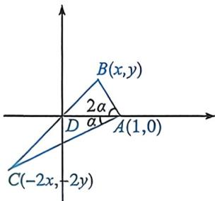

<!-- question-source:start -->
例43 (2026届广东开学衡水金卷联考T14) $\triangle ABC$ 中， $D$ 为边 $BC$ 上靠近点 $B$ 的三等分点，且 $\angle DAB = 2$ $\angle DAC,AD = 1$ ，则 $BC$ 长度的取值范围为

<!-- question-source:end -->

![[高中/总复习/二轮/2026版高中《MST新思路思维拓展》二轮复习专题/上册/板块3_三角/考点五_建系处理_化繁为简/questions/answers/Q00093006A1.md]]
