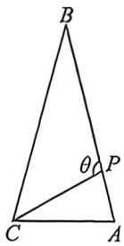
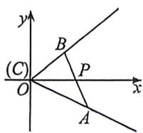

<!-- question-source:start -->
例28 (2026 届重庆南开中学十月月考 T11·多选) 在 $\triangle ABC$ 中, $P$ 为边 $AB$ 上一点, $CP = 1$ , $\angle ACP = 30^{\circ}$ , $\angle BCP = 45^{\circ}$ , $AP = \lambda BP$ , $\angle CPB = \theta$ , 则( )

A. 若 $\theta = 120^{\circ}$ , 则 $\sin B = \frac{\sqrt{6} - \sqrt{2}}{2}$ B. 若 $\theta = 120^{\circ}$ , 则 $\lambda = \frac{\sqrt{3} - 1}{4}$ C. 若 $\lambda = 1$ , 则 $AC = \sqrt{2} BC$ D. 当 $\triangle ABC$ 面积最小时, $\tan \theta = \sqrt{3} + 1$

先项 A, 因为 $\angle BCP = 45^{\circ}$ , $\angle BPC = \theta = 120^{\circ}$ , 所以 $\angle B = 15^{\circ}$ . 因此 $\sin B = \sqrt{\frac{1 - \cos30}{2}} = \sqrt{\frac{2 - \sqrt{3}}{4}} = \frac{\sqrt{3} - 1}{2\sqrt{2}} = \frac{\sqrt{5} - \sqrt{2}}{4}$ , 故选项 A 错误.

对于选项 B, 因为 $\angle ACP = 30^{\circ}, \angle BPC = \theta = 120^{\circ}$ , 所以 $\angle A = 90^{\circ}$ , 因此 $CA = \sqrt{3}AP$ .

由选项 A 可知， $\sin B=\frac{\sqrt{6}-\sqrt{2}}{4}$ ，所以 $\cos B=\frac{\sqrt{6}+\sqrt{2}}{4}$ ， $\tan B=\frac{\sqrt{6}-\sqrt{2}}{\sqrt{6}+\sqrt{2}}$ 。因此 $\frac{CA}{AB}=\frac{\sqrt{6}-\sqrt{2}}{\sqrt{6}+\sqrt{2}}$ ，即 $CA=(2-\sqrt{3})AB=(2-\sqrt{3})(AP+PB)$ 。故 $\sqrt{3}AP=(2-\sqrt{3})(AP+PB)$ ，解得 $AP=\frac{\sqrt{3}-1}{4}PB$ ，故选项 B 正确。

对于选项 CD, 法一: 当 $\lambda = 1$ 时, $AP = PB$ , 即 $P$ 为 $AB$ 中点. 对于 $\triangle ACP$ , 由正弦定理得, $\frac{AC}{\sin \angle CPA} = \frac{AP}{\sin \angle ACP}$ , 即 $AC = 2AP \cdot \sin \angle CPA$ . 对于 $\triangle BCP$ , 由正弦定理得, $\frac{BC}{\sin \angle BPC} = \frac{BP}{\sin \angle BCP}$ , 即 $BC = \sqrt{2}BP \cdot \sin \angle BPC$ .

又因为 $\angle CPA + \angle BPC = 180^{\circ}$ ，所以 $\sin \angle CPA = \sin \angle BPC.$ 所以 $\frac{AC}{BC} = \frac{2AP}{\sqrt{2}BP} = \sqrt{2}$ ，即 $AC = \sqrt{2} BC,C$ 正确；

对于选项 D, 法一: $S_{\triangle BCP} = \frac{1}{2} BC \cdot \sin 45^{\circ} = \frac{\sqrt{2}}{4} BC, S_{\triangle ACP} = \frac{1}{2} AC \cdot \sin 30^{\circ} = \frac{1}{4} AC$ , 所以 $S_{\triangle ABC} = \frac{\sqrt{2}}{4} BC + \frac{1}{4} AC.$

在 $\triangle ACP$ 中，由正弦定理得， $\frac{AC}{\sin(180^\circ - \theta)} = \frac{CP}{\sin(\theta - 30^\circ)}$ ，化简得 $AC = \frac{2\sin\theta}{\sqrt{3}\sin\theta - \cos\theta}$ .

在 $\triangle BCP$ 中，由正弦定理得， $\frac{BC}{\sin\theta} = \frac{CP}{\sin(135^\circ - \theta)}$ ，化简得 $BC = \frac{\sqrt{2}\sin\theta}{\cos\theta + \sin\theta}$

因此， $S_{\triangle ABC} = \frac{1}{2}\left(\frac{\sin\theta}{\cos\theta + \sin\theta} +\frac{\sin\theta}{\sqrt{3}\sin\theta - \cos\theta}\right) = \frac{1}{2}\left(\frac{1}{\frac{1}{\tan\theta} + 1} +\frac{1}{\sqrt{3} - \frac{1}{\tan\theta}}\right)$ 设 $\frac{1}{\tan\theta} = m.$

则 $S_{\triangle \mathcal{A}\mathcal{B}C} = \frac{1}{2}\left(\frac{1}{m + 1} +\frac{1}{\sqrt{3} - m}\right) = \frac{\sqrt{3} + 1}{2}\frac{1}{(m + 1)(\sqrt{3} - m)}.$ 由二次函数性质可知， $f(m) = (m + 1)(\sqrt{3} -m)$
<!-- question-source:end -->

![[高中/总复习/二轮/2026版高中《MST新思路思维拓展》二轮复习专题/上册/板块3_三角/考点五_建系处理_化繁为简/questions/answers/Q00093243A1.md]]
