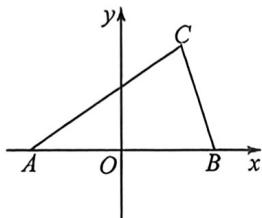

<!-- question-source:start -->
例44 (2026 届江苏淮安阶段练习)已知 $\triangle ABC$ 满足 $8BC^{2} + 8AC^{2} + 5AB^{2} = 20$ , 则 $\triangle ABC$ 面积的最大值为 \_\_\_\_.

<!-- question-source:end -->

![[高中/总复习/二轮/2026版高中《MST新思路思维拓展》二轮复习专题/上册/板块3_三角/考点五_建系处理_化繁为简/questions/answers/Q00093307A1.md]]
