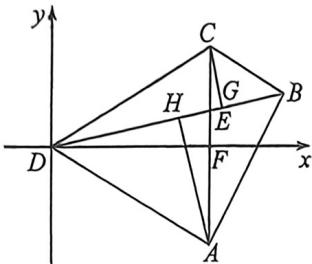
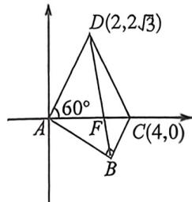

<!-- question-source:start -->
例4 (2025·广州二模 T14)在平面四边形 ABCD 中, AC=AD=4, $\angle CAD=60^{\circ}$ , $\angle ABC=90^{\circ}$ , 若 $\triangle ABD$ 的面积是 $\triangle BCD$ 的面积的 2 倍, 则 BD 的长度为 \_\_\_\_.

修题法一:如图,以D点为原点,取AC中点为F,以DF所在直线为x轴,以过D点,垂直于DF直线为y轴,建立直角坐标系.又 $AC=AD=4,\angle CAD=60^{\circ}$ .则 $D(0,0),A(2\sqrt{3},-2),B(x,y),C(2\sqrt{3},2)$ .

过 $C, A$ 两点作 $DB$ 垂线，垂足为 $G, H$ ，则 $\frac{S_{\triangle ABD}}{S_{\triangle BCD}} = \frac{\frac{1}{2}AH \cdot BD}{\frac{1}{2}CG \cdot BD} = \frac{AH}{CG} = 2.$ 又注意到 $\triangle AHE \sim \triangle CGE$ ，则 $\frac{AE}{EC} = 2.$ 设 $E(x_1, y_1)$ ，则 $\overrightarrow{CE} = \frac{1}{3}\overrightarrow{CA}$ ，则 $(x_1 - 2\sqrt{3}, y_1 - 2) = \frac{1}{3}(0, -4) \Rightarrow E\left(2\sqrt{3}, \frac{2}{3}\right)$ . 注意到 $B, E, D$ 三点共线，则 $\overrightarrow{DE} // \overrightarrow{DB}$ ，则 $\frac{2}{3}x = 2\sqrt{3}y \Rightarrow x = 3\sqrt{3}y$ 又 $AC = \sqrt{BC^2 + BA^2} = 4 \Rightarrow 2(x - 2\sqrt{3})^2 + (y - 2)^2 + (y + 2)^2 = 16$

$\Rightarrow x^{2} - 4\sqrt{3} x + y^{2} + 8 = 0 \Rightarrow 7y^{2} - 9y + 2 = 0 \Rightarrow (y - 1)(7y - 2) = 0$ ，则 $y = 1$ 或 $y = \frac{2}{7}$ ，又由图可得 $x > 2\sqrt{3} \Rightarrow y = 1, x = 3\sqrt{3}$ ，则 $B(3\sqrt{3}, 1)$ . 则 $DB = \sqrt{27 + 1} = 2\sqrt{7}$ .

<!-- question-source:end -->

![[高中/总复习/二轮/2026版高中《MST新思路思维拓展》二轮复习专题/上册/板块3_三角/考点五_建系处理_化繁为简/questions/answers/Q00093341A1.md]]
