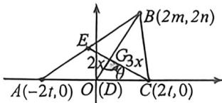

> [!faq]- 例题解析
>
> > [!success]- **【答案】** $\frac{\sqrt{10}}{3}$
>
> > [!note]- **【解析】**
> > 解析：设 $BD \cap CE = G$ ，易知 $G$ 为 $\triangle ABC$ 的重心，又 $BD = \frac{4}{3} CE$ ，由重心为中线三等分点可得： $BG = \frac{4}{3} CG$ ，同时 $S_{\triangle BCC} = \frac{2}{3} S_{\triangle BCD} = \frac{1}{3} S_{\triangle ABC} = \frac{1}{3}$ ，设 $CG = 3x, \angle CGD = \theta$ ，则 $BG = 4x, GD = 2x$ ，
> >
> > 则 $S_{\triangle \alpha x} = \frac{1}{2}(3x)(4x)\sin (\pi -\theta) = 6x^{2}\sin \theta = \frac{1}{3}$ ，所以 $x^{2} = \frac{1}{18\sin\theta}$ ，由余弦定理可得： $AC = 2CD = 2$ $\sqrt{4x^2 + 9x^2 - 12x^2\cos\theta} = 2\sqrt{\frac{13 - 12\cos\theta}{18\sin\theta}}$ ，令 $z = \frac{13 - 12\cos\theta}{\sin\theta}$ ，求其最小值即可，上式化简可得： $13 = 12\cos \theta +z\sin \theta \leqslant$ $\sqrt{(12^2 + z^2)(\cos^2\theta + \sin^2\theta)} = \sqrt{12^2 + z^2}$ ，也即 $z^{2}\geqslant 13^{2} - 12^{2} = 25$ 当且仅当 $5\sin \theta +12\cos \theta = 13$ 时取得等号，所以 $AC$ $= 2\sqrt{\frac{13 - 12\cos\theta}{18\sin\theta}}\geqslant 2\sqrt{\frac{5}{18}} = \frac{\sqrt{10}}{3},$
> >
> > 
> >
> > 法二：建系， $A(-2t,0),C(2t,0),B(2m,2n),S_{\triangle ABC} = \frac{1}{2}\times 4t\times 2n = 4nt = 1$ ，由于 $3BD = 4CE$ ，故 $9(4m^2 +4n^2) = 16[13(3b - m)^2 +n^2 ]\Rightarrow 5m^2 +24tm + 5n^2 -36t^2 = 0$ ，关于 $m$ 的方程有解 $\Delta = 24^{3}b^{2} - 20^{2}$ $(5n^{2} - 36t^{2})\geqslant 0,n = \frac{1}{4t},t^{2}\geqslant \frac{5}{72},AC = 4t\geqslant \frac{\sqrt{10}}{3}$ 故答案为： $\frac{\sqrt{10}}{3}$
