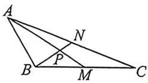
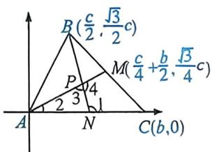

> [!faq]- 例题解析
>
> > [!success]- **【答案】** $\frac{\sqrt{3}}{2}$
>
> > [!note]- **【解析】**
> > (1) 因为 $\frac{c}{a} = \frac{2\cos B + \cos C}{2 - \cos A}$ ，由正弦定理，得 $\frac{\sin C}{\sin A} = \frac{2\cos B + \cos C}{2 - \cos A}$ ，即 $2\sin C - \cos A\sin C = 2\sin A\cos B + \sin A\cos C$ ，因为 $\sin A\cos C + \cos A\sin C = \sin(A + C)$ ，所以 $2\sin C = 2\sin A\cos B + \sin B$ ，而 $\sin C = \sin(A + B) = \sin A\cos B + \cos A\sin B$ ，整理得 $2\cos A\sin B = \sin B$ ，因为 $\triangle ABC$ 中， $\sin B > 0$ ，所以 $\cos A = \frac{1}{2}$ ，又 $A \in (0, \pi)$ ，所以 $A = \frac{\pi}{3}t$ (2) 法一：AM 是边 BC 的中线，故 $\overrightarrow{AM} = \frac{1}{2} (\overrightarrow{AB} + \overrightarrow{AC})$ ，则 $\overrightarrow{AM^2} = \frac{1}{4} (\overrightarrow{AB^2} + \overrightarrow{AC^2} + 2 |\overrightarrow{AB}| | \overrightarrow{AC}| \cos \frac{\pi}{3})$ ，不妨设 c = 1，则 $AM = \frac{\sqrt{21}}{2}$ ，所以 $\left(\frac{\sqrt{21}}{2}\right)^2 = \frac{1}{4} \times (1^2 + b^2 + b)$ ，即 $b^2 + b - 20 = 0$ ，解得 b = 4 或 b = -5（舍去），所以 $AN = \frac{b}{2} = 2$ ，在 $\triangle ABN$ 中，由正弦定理有 $\frac{AN}{\sin\angle ABN} = \frac{AB}{\sin\angle ANB}$ ，即 $\frac{2}{\sin\angle ABN} = \frac{1}{\sin\left(\frac{\pi}{3} + \angle ABN\right)} = \frac{1}{\sin\frac{\pi}{3}\cos\angle ABN + \cos\frac{\pi}{3}\sin\angle ABN}$ ，解得 $\cos\angle ABN = 0$ ，即 $\angle ABN = \frac{\pi}{2}$ ，所以在 Rt $\triangle ABN$ 中， $BN = \sqrt{AN^2 - c^2} = \sqrt{4 - 1} = \sqrt{3}$ ，又两条中线 AM, BN 相交于点 P，可知 P 是 $\triangle ABC$ 的重心，所以 $BP = \frac{2}{3}BN = \frac{2\sqrt{3}}{3}$ ，所以 $\tan\angle MPN = \tan\angle APB = \frac{AB}{BP} = \frac{1}{\frac{2\sqrt{3}}{3}} = \frac{\sqrt{3}}{2}$ .
> >
> > 
> >
> > 
> >
> > 法二(建系): $A(0,0)$ , $C(b,0)$ , $B\left(\frac{c}{2},\frac{\sqrt{3}c}{2}\right)$ ，则 $M\left(\frac{c}{4}+\frac{b}{2},\frac{\sqrt{3}c}{4}\right)$ ，设 $\angle BNC=\angle1$ , $\angle CAM=\angle2$ , $\angle APN=\angle3$ ,
> >
> > $$
> > \angle M P N = \angle 4, | A M | ^ {2} = \frac {c ^ {2} + b c + b ^ {2}}{4} = \frac {2 1 c ^ {2}}{4} \Rightarrow b ^ {2} + c b - 2 0 c ^ {2} = 0, (b - 4 c) (b + 5 c) = 0 \Rightarrow b = 4 c,
> > $$
> >
> > $\tan \angle 1 = k_{BN} = -\frac{\sqrt{3}}{3}, \tan \angle 2 = k_{AM} = \frac{\sqrt{3}}{9}, \tan \angle 3 = \tan (\angle 1 - \angle 2) = -\frac{\sqrt{3}}{2}, \tan \angle 4 = -\tan \angle 3 = \frac{\sqrt{3}}{2}$ 故答案为 $\frac{\sqrt{3}}{2}$ .
