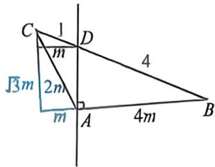

> [!faq]- 例题解析
>
> > [!success]- **【答案】** BCD
>
> > [!note]- **【解析】**
> > 当 $m = \frac{\sqrt{3} - 1}{2}$ 时， $f(m)$ 取最大值，且最大值为正。即当 $m = \frac{\sqrt{3} - 1}{2}, S_{\triangle ABC}$ 取最小值，此时 $\tan \theta = \frac{1}{m} = \frac{2}{\sqrt{3} - 1} = \sqrt{3} + 1$ ，故选项D正确。
> >
> > 法二:如图,AB:x=ty+1,OA:x=- $\sqrt{3}$ y,联立得: $y_{A}=-\frac{1}{t+\sqrt{3}}$ ,OB:x=y,联立得 $y_{B}=-\frac{1}{t-1}$ , $\lambda=1$ ,故 $y_{A}+y_{B}=0$ , $t=\frac{1-\sqrt{3}}{2},|AC|=-2y_{A},|AB|=\sqrt{2}y_{B},AC=\sqrt{2}BC,$ 选项C正确.
> >
> > 当 $\triangle ABC$ 面积最小时， $|y_B - y_A| = \left|\frac{1}{1 - t} + \frac{1}{t + \sqrt{3}}\right|$ 取得最小，只考虑都为正得情况，由柯西不等式得 $[(1 - t) + (t + \sqrt{3})]\left(\frac{1}{1 - t} + \frac{1}{t + \sqrt{3}}\right) \geqslant 4, \frac{1}{1 - t} + \frac{1}{t + \sqrt{3}} \geqslant \frac{4}{1 + \sqrt{3}} = 2(\sqrt{3} - 1)$ ，当且仅当 $t = \frac{-\sqrt{3} + 1}{2}$ 时取等，此时 $\tan \theta = -\frac{1}{t} = \frac{2}{\sqrt{3} - 1}$
> >
> > $=\sqrt{3}+1$ , 故选项 D 正确。故选: BCD.
> >
> > 例义 (2025·福州九市联考)记△ABC的内角A,B,C的对边分别为a,b,c,已知 $a\cos C-c\cos A=c+b$ .
> >
> > (1) 求 A;
> >
> > (2) $D$ 为边 $BC$ 上一点, 若 $\angle BAD = 90^{\circ}$ , 且 $BD = 4DC = 4$ , 求 $\triangle ABC$ 的面积.
> >
> > 
> >
> > 解析 (1)由正弦定理得, $\sin A\cos C - \sin C\cos A = \sin C + \sin B$ , 因为 $\sin B = \sin (A + C) = \sin A\cos C + \cos A\sin C$ , 所以 $2\sin C\cos A + \sin C = 0$ , 由于 $0^{\circ} < C < 180^{\circ}$ , 故 $\sin C > 0$ , $\cos A = -\frac{1}{2}$ , 而 $0^{\circ} < A < 180^{\circ}$ , 因此 $A = 120^{\circ}$ ;
> >
> > (2)如图,以A为原点建系,B(4m,0)又 $\sqrt{3}m^{2}+5m^{2}=5^{2}\Rightarrow m^{2}=\frac{25}{28}$ , $S_{\Delta}=\frac{1}{2}\times4m^{2}\times\sqrt{3}m=2\sqrt{3}m^{2}=\frac{25}{14}\sqrt{3}$ .
