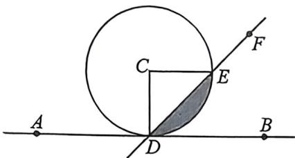

<!-- question-source:start -->
例36 (2026届广东大湾区一棋T10·多选)如图, 直线AB与半径为1的圆C相切于D点, 射线DB绕着D点逆时针方向旋转到DA, 在旋转过程中射线DB交圆C于E点, 设 $\angle BDE=x, x \in[0,\pi]$ , 射线DB扫过圆C内部(阴影部分)的面积为 $S=f(x)$ , 则

A. $f\left(\frac{\pi}{4}\right) = \frac{\pi}{4} -\frac{1}{2}$ B. $f(x)\geqslant 2x - \frac{\pi}{2}$ 当 $x\in \left(\frac{\pi}{2},\frac{2\pi}{3}\right)$ C.直线 $x = \frac{\pi}{2}$ 为 $f(x)$ 的对称轴 D. $f(x)$ 在 $x = \frac{\pi}{2}$ 瞬时变化率最大
<!-- question-source:end -->

![[高中/总复习/二轮/2026版高中《MST新思路思维拓展》二轮复习专题/上册/板块3_三角/考点四_利用导数分析三角函数/questions/answers/Q00092938A1.md]]
