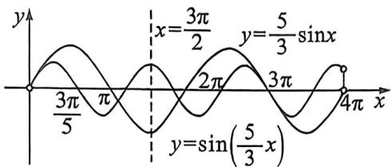

> [!faq]- 例题解析
>
> > [!success]- **【答案】** $3; 6\pi$
>
> > [!note]- **【解析】**
> > 解：当 $f(x) = \frac{5}{3} \left( \cos \left( \frac{5}{3} x \right) - \cos x \right)$ ，取 $x \in \left( 0, \frac{3}{5} \pi \right)$ ，则 $\frac{5}{3} x \in (0, \pi)$ ，且 $\frac{5}{3} x > x$ ，因为 $y = \cos x$ 在 $(0, \pi)$ 上单调递减，所以 $\cos \left( \frac{5}{3} x \right) - \cos x < 0$ ，即 $f(x)$ 在 $(0, \frac{3}{5} \pi)$ 上单调递减， $f(x) < f(0) = 0$ ，即此时 $f(x)$ 无零点，分别作出 $y = \sin \left( \frac{5}{3} x \right)$ ， $y = \frac{5}{3} \sin x$ 的图象如下，两函数都关于 $x = \frac{3}{2} \pi$ 轴对称，且都关于 $(3\pi, 0)$ 中心对称，显然由上结合图象可知 $(0, \pi]$ 上两函数无交点， $(\pi, \frac{3}{2} \pi)$ 有一个交点，又由两函数的轴对称性可知 $\left[ \frac{3\pi}{2}, 3\pi \right)$ 也有一个交点，又 $x = 3\pi$ 时，两函数相交，此时相交，再由两函数的中心对称性知 $(3\pi, 4\pi)$ 上无交点，综上所述，两函数共有三个交点，其中一个为 $(3\pi, 0)$ ，另外两个关于 $x = \frac{3}{2}\pi$ 轴对称，故三个交点横坐标之和为 $6\pi$ . 故答案为： $3; 6\pi$ .
> >
> > 
