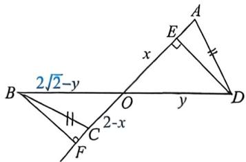

<!-- question-source:start -->
例37 (2025·武汉二调 T17)如图, $\triangle AOD$ 与 $\triangle BOC$ 存在对顶角 $\angle AOD = \angle BOC = \frac{\pi}{4}, AC = 2, BD = 2\sqrt{2}$ , 且 $BC = AD$ .

(1)证明: $O$ 为 $B D$ 中点;

(2)若 $\sqrt{5}\sin2A+\cos B=\sqrt{5}$ ，求OC的长.

<!-- question-source:end -->

![[高中/总复习/二轮/2026版高中《MST新思路思维拓展》二轮复习专题/上册/板块3_三角/考点四_解三角形不等式构造/questions/answers/Q00093340A1.md]]
