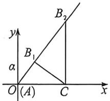
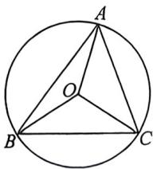

> [!faq]- 例题解析
>
> > [!success]- **【答案】** ACD
>
> > [!note]- **【解析】**
> > 解析 $\lambda_{1}$ 由 $(\sin C - \sin A)(c + a) = (c - b)\sin B$ 和正弦定理，可得 $(c - a)(c + a) = b(c - b)$ ，即 $c^{2} - a^{2} = bc - b^{2}$ ，则 $c^{2} + b^{2} - a^{2} = bc$ ，由余弦定理， $\cos A = \frac{c^{2} + b^{2} - a^{2}}{2bc} = \frac{bc}{2bc} = \frac{1}{2}$ ，又 $A \in (0, \pi)$ ，故 $A = \frac{\pi}{3}$ ，故 A 正确；
> >
> > 对 B: 因 $A + B + C = \pi$ ，由正弦定理 $\frac{a}{\sin A} = \frac{b}{\sin B}$ ，可得 $\frac{a}{\frac{\sqrt{3}}{2}} = \frac{b}{\sin(A + C)}$ ，即 $a = \frac{\frac{\sqrt{3}}{2} b}{\sin\left(C + \frac{\pi}{3}\right)}$ ①，
> >
> > 又因为 $a\sin C = \sqrt{3}(2 - a\cos C)$ ，则 $\sqrt{3} a\cos C + a\sin C = 2\sqrt{3}$ ，即 $2a\left(\frac{\sqrt{3}}{2}\cos C + \frac{1}{2}\sin C\right) = 2\sqrt{3}$ ，也即 $2a\sin \left(C + \frac{\pi}{3}\right) = 2\sqrt{3}$
> > - **②**：，将①代入②可得 $2 \cdot \frac{b \cdot \frac{\sqrt{3}}{2}}{\sin\left(\frac{\pi}{3} + C\right)} \cdot \sin\left(C + \frac{\pi}{3}\right) = 2\sqrt{3}$ ，解得 $b = 2$ ，故B错误；
> >
> > 对 C: 法一(强哥硬解): 由 $\triangle ABC$ 为锐角三角形, 则 $\left\{\begin{aligned} &C=\pi-\frac{\pi}{3}-B\in\left(0,\frac{\pi}{2}\right) \\ &B\in\left(0,\frac{\pi}{2}\right)\end{aligned}\right.$ , 解得 $B\in\left(\frac{\pi}{6},\frac{\pi}{2}\right)$ , 由正弦定理, $\frac{a}{\sin A}$
> >
> > $= \frac{b}{\sin B} = \frac{c}{\sin C}$ 则 $\frac{a}{\frac{\sqrt{3}}{2}} = \frac{2}{\sin B} = \frac{c}{\sin C}$ 则 $a = \frac{\sqrt{3}}{\sin B}, c = \frac{2\sin C}{\sin B} = \frac{2\sin(B + A)}{\sin B} = \frac{\sin B + \sqrt{3}\cos B}{\sin B},$
> >
> > $$
> > a + b + c = \frac {\sqrt {3}}{\sin B} + \frac {\sin B + \sqrt {3} \cos B}{\sin B} + 2 = 3 + \frac {\sqrt {3} (1 + \cos B)}{\sin B} = 3 + \frac {\sqrt {3} \left(1 + 2 \cos^ {2} \frac {B}{2} - 1\right)}{2 \sin \frac {B}{2} \cos \frac {B}{2}} = 3 + \frac {\sqrt {3}}{\tan \frac {B}{2}},
> > $$
> >
> > 由 $B \in \left(\frac{\pi}{6}, \frac{\pi}{2}\right)$ , 则 $\tan \frac{B}{2} \in \left(\tan \frac{\pi}{12}, 1\right)$ , 由 $\tan \frac{\pi}{12} = \tan \left(\frac{\pi}{4} - \frac{\pi}{6}\right) = \frac{\tan \frac{\pi}{4} - \tan \frac{\pi}{6}}{1 + \tan \frac{\pi}{4} \tan \frac{\pi}{6}} = \frac{1 - \frac{\sqrt{3}}{3}}{1 + 1 \cdot \frac{\sqrt{3}}{3}} = 2 - \sqrt{3}$ ,
> >
> > 故 $\tan \frac{B}{2} \in (2 - \sqrt{3}, 1)$ ，则 $\frac{\sqrt{3}}{\tan \frac{B}{2}} \in (\sqrt{3}, 3 + 2\sqrt{3})$ ，则 $a + b + c = 3 + \frac{\sqrt{3}}{\tan \frac{B}{2}} \in (3 + \sqrt{3}, 6 + 2\sqrt{3})$
> >
> > 法二:如图,以A作为原点建系,故 $C(2,0)$ ,B在直线 $y=\sqrt{3}x$ 上运动,且由于是锐角三角形,则B位于 $B_{1}\left(\frac{1}{2},\frac{\sqrt{3}}{2}\right)$ 到 $B_{2}(2,2\sqrt{3})$ 之间,在此区间,周长是逐渐增大的,故 $a+b+c\in(3+\sqrt{3},6+2\sqrt{3})$ ,C正确;
> >
> > 
> >
> > 
> >
> > 对 D: 设 $\triangle ABC$ 外接圆半径为 R，则 $OA = OB = OC = R, 2R = \frac{b}{\sin B} = \frac{2}{\sin B}$ ，即 $R = \frac{1}{\sin B}$ ，
> >
> > 因为 $\angle AOC = 2B, \angle BOC = 2A = \frac{2\pi}{3}$ , 所以 $S_{\triangle OIC} = \frac{1}{2} R^2 \cdot \sin \angle AOC = \frac{1}{2} \cdot \frac{1}{\sin^2 B} \cdot \sin 2B = \frac{1}{\tan B}$ .
> >
> > $$
> > S _ {\Delta} \alpha c = \frac {1}{2} \cdot \frac {1}{\sin^ {2} B} \cdot \sin \frac {2 \pi}{3} = \frac {\sqrt {3}}{4} \cdot \frac {\sin^ {2} B + \cos^ {2} B}{\sin^ {2} B} = \frac {\sqrt {3}}{4} \cdot \left(1 + \frac {1}{\tan^ {2} B}\right),
> > $$
> >
> > 所以 $S_{\triangle OAC} - S_{\triangle OBC} = \frac{1}{\tan B} -\frac{\sqrt{3}}{4}\left(1 + \frac{1}{\tan^2B}\right) = -\frac{\sqrt{3}}{4},\frac{1}{\tan^2B} +\frac{1}{\tan B} -\frac{\sqrt{3}}{4}$ ，由 $B\in \left(\frac{\pi}{6},\frac{\pi}{2}\right)$ ，则 $\tan B\in \left(\frac{\sqrt{3}}{3}, + \infty\right)$ ，令 $x$ $= \frac{1}{\tan B}\in (0,\sqrt{3})$ ，则 $S_{\triangle OAC} - S_{\triangle OBC} = f(x) = -\frac{\sqrt{3}}{4} x^2 +x - \frac{\sqrt{3}}{4} = -\frac{\sqrt{3}}{4}\left(x - \frac{2\sqrt{3}}{3}\right)^2 +\frac{\sqrt{3}}{12};$ △OAC和△OBC面积之差的取值范围为 $\left(-\frac{\sqrt{3}}{4},\frac{\sqrt{3}}{12}\right]$ ，故D正确.
> >
> > 故选 **ACD**.
