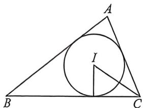
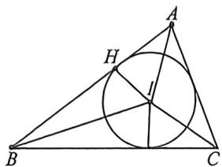

> [!faq]- 例题解析
>
> > [!success]- **【答案】** 详见解析
>
> > [!note]- **【解析】**
> > 解析 (1) 由 $S_{\triangle ABC} = \frac{\sqrt{3}}{4} (a^2 + b^2 - c^2) = \frac{1}{2} ab\sin C$ ，则 $a^2 + b^2 - c^2 = \frac{2}{\sqrt{3}} ab\sin C,$
> >
> > 根据余弦定理得 $\cos C = \frac{a^2 + b^2 - c^2}{2ab} = \frac{\sin C}{\sqrt{3}}$ ，即 $\tan C = \sqrt{3}$ ，由 $0 < C < \pi$ ，则 $C = \frac{\pi}{3}$ .
> >
> > (2)由(1)知, $a^{2}+b^{2}-c^{2}=ab$ ,则有 $(a+b)^{2}-c^{2}=3ab$ ,又 $ab\leqslant\frac{(a+b)^{2}}{4}$ ,当且仅当a=b时等号成立,
> >
> > 所以 $(a + b)^2 - c^2 \leqslant \frac{3}{4} (a + b)^2$ ，解得 $\frac{1}{4} (a + b)^2 \leqslant c^2$ ，所以 $a + b \leqslant 2c$ ，当且仅当 $a = b$ 取到等号，
> >
> > (3)法一:设 $\triangle ABC$ 的内切圆 $I$ 的半径为 $r$ ,由等面积法可得 $S_{\triangle ABC}=\frac{1}{2}ab\sin C=\frac{1}{2}r(a+b+c)$ ,故 $r=\frac{ab\sin C}{a+b+c}=\frac{\sqrt{3}}{2}\cdot\frac{ab}{a+b+c}$ ,所以 $|CI|=\frac{r}{\sin\frac{C}{2}}=2r$ ,故 $\frac{|AB|}{|CI|}=\frac{c}{2r}=\frac{c}{\sqrt{3}\cdot\frac{ab}{a+b+c}}=\frac{(a+b+c)c}{\sqrt{3}ab}$
> >
> > $$
> > = \frac {c ^ {2} + (a + b) c}{\sqrt {3} a b} = \frac {\left[ c + \frac {(a + b)}{2} \right] ^ {2} - \frac {(a + b) ^ {2}}{4}}{\sqrt {3} a b} \geqslant \frac {\left[ \frac {(a + b)}{2} + \frac {(a + b)}{2} \right] ^ {2} - \frac {(a + b) ^ {2}}{4}}{\sqrt {3} a b} = \frac {\frac {3 (a + b) ^ {2}}{4}}{\sqrt {3} a b} = \frac {\sqrt {3} (a + b) ^ {2}}{4 a b} =
> > $$
> >
> > $$
> > \frac {\sqrt {3} (a ^ {2} + 2 a b + b ^ {2})}{4 a b} = \frac {\sqrt {3}}{4} \left(\frac {b}{a} + \frac {a}{b} + 2\right) \geqslant \frac {\sqrt {3}}{4} \cdot \left(2 \sqrt {\frac {b}{a} \cdot \frac {a}{b}} + 2\right) = \sqrt {3},
> > $$
> >
> > 当且仅当 $a = b$ 时等号成立，所以 $\frac{|AB|}{|CI|}$ 的最小值为 $\sqrt{3}$ .
> >
> > 
> >
> > 
> >
> > 法二：如图， $|CI| = \frac{r}{\sin\frac{C}{2}} = 2r, \angle AIH = \alpha, \angle BIH = \beta,$ 所以 $AH = r\tan \alpha, BH = r\tan \beta$ ，易知 $\alpha + \beta = 120^{\circ}$
> >
> > $\tan (\alpha +\beta) = \frac{\tan\alpha + \tan\beta}{1 - \tan\alpha\tan\beta} = -\sqrt{3}\Rightarrow \tan \alpha +\tan \beta = -\sqrt{3}(1 - \tan \alpha \tan \beta)\leqslant -\sqrt{3} +\sqrt{3}\left(\frac{\tan\alpha + \tan\beta}{2}\right)^2$ ，故 $\tan \alpha +\tan \beta \geqslant 2\sqrt{3},$
> >
> > 当且仅当 $\tan \alpha = \tan \beta = \sqrt{3}$ 时取等， $\frac{|AB|}{|CI|} = \frac{\tan \alpha + \tan \beta}{2} \geqslant \sqrt{3}$ .
