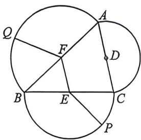

> [!faq]- 例题解析
>
> > [!success]- **【答案】** A
>
> > [!note]- **【解析】**
> > 解析 使 $AC, BC, AB$ 边的中点分别为 $D, E, F$ , 当 $P, Q$ 位于两个不同的半圆上时, 例如点 $P$ 在以 $BC$ 为直径的半圆上, 点 $Q$ 在以 $AB$ 为直径的半圆上, 则 $PQ \leqslant PE + EF + FQ = \frac{1}{2} BC + \frac{1}{2} AC + \frac{1}{2} AB$ , 当且仅当 $P, E, F, Q$ 共线时等号成立, 当 $P, Q$ 在同一半圆上时, 最大距离为该半圆的直径, 根据三角形两边之和大于第三边可知, 半周长大于任意一边, 故 $PQ$ 的最大值是 $\triangle ABC$ 的半周长, 即 $\frac{1}{2}(AB + BC + AC)$ .
> >
> > 
> >
> > 法一: $\triangle ABC$ 中, 由余弦定理 $BC^{2} + AC^{2} - 2BC \cdot AC\cos C = AB^{2}$ , 得 $(BC + AC)^{2} - 3AC \cdot BC = 12$ , 因为 $\sqrt{AC \cdot BC} \leqslant \frac{AC + BC}{2}$ , 当且仅当 $AC = BC$ 时, 等号成立. , 所以 $AC \cdot BC \leqslant \frac{(AC + BC)^{2}}{4}$ , 所以 $(AC + BC)^{2} - 12 \leqslant \frac{3(AC + BC)^{2}}{4}$ , 即 $(AC + BC)^{2} \leqslant 48$ , 所以 $2\sqrt{3} < AC + BC \leqslant 4\sqrt{3}$ , 当且仅当 $AC = BC = 2\sqrt{3}$ 时, $AC + BC$ 的最大值 $4\sqrt{3}$ . 此时, $PQ$ 取得最大值 $3\sqrt{3}$ .
> >
> > 法二:根据正弦定理 $\frac{AC}{\sin B}=\frac{AB}{\sin C}=\frac{BC}{\sin A}$ ，得 $\frac{AC}{\sin B}=\frac{BC}{\sin A}=\frac{2\sqrt{3}}{\frac{\sqrt{3}}{2}}=4$ ，所以 $BC=4\sin A,AC=4\sin B=4\sin\left(\frac{2\pi}{3}-A\right)$ ，所以 $BC+AC=4\sin A+4\sin\left(\frac{2\pi}{3}-A\right)=4\sin A+4\times\left(\sin\frac{2\pi}{3}\cos A-\cos\frac{2\pi}{3}\sin A\right)=6\sin A+2\sqrt{3}\cos A.$
> >
> > $6\sin A+2\sqrt{3}\cos A=4\sqrt{3}\left(\sin A\times\frac{\sqrt{3}}{2}+\cos A\times\frac{1}{2}\right)=4\sqrt{3}\sin\left(A+\frac{\pi}{6}\right)$ ，因为 $A\in\left(0,\frac{2\pi}{3}\right)$ ，所以 $A+\frac{\pi}{6}\in\left(\frac{\pi}{6},\frac{5\pi}{6}\right)$ ，所以 $\sin\left(A+\frac{\pi}{6}\right)\in\left(\frac{1}{2},1\right]$ ，所以 $4\sqrt{3}\sin\left(A+\frac{\pi}{6}\right)\in\left(2\sqrt{3},4\sqrt{3}\right]$ ，当且仅当 $A=\frac{\pi}{3}$ 时， $BC+AC=4\sqrt{3}\sin\left(A+\frac{\pi}{6}\right)$ 取得最大值 $4\sqrt{3}$ .此时 $\frac{1}{2}(BC+AC)$ 取得最大值 $2\sqrt{3}$ .所以PQ的最大值为 $3\sqrt{3}$ .故答案为： $3\sqrt{3}$ .
