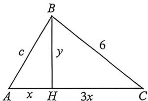

> [!faq]- 例题解析
>
> > [!success]- **【答案】** D
>
> > [!note]- **【解析】**
> > 解析 由题意可设三角形的三边长为 $a, b, c$ ，不妨设 $a \leqslant b \leqslant c$ ，由于三边长成等差数列，故 $2b = a + c$
> >
> > 由于三角形中，需满足 $a + b > c, (a + c > b, b + c > a$ 恒成立），结合 $c = 2b - a$ ，则 $a + b > 2b - a$ ，得 $2a > b$
> >
> > 又三角形为锐角三角形，需满足 $\cos C > 0$ ，即 $\cos C = \frac{a^2 + b^2 - c^2}{2ab} = \frac{a^2 + b^2 - (2b - a)^2}{2ab} = \frac{4a - 3b}{2a} > 0$ ，即 $4a - 3b > 0$ ，即 $b < \frac{4}{3} a$ ，结合 $2a > b$ ，可得 $a \leqslant b < \frac{4}{3} a$ ；又 $\cos A = \frac{b^2 + c^2 - a^2}{2bc} = \frac{b^2 + (2b - a)^2 - a^2}{2b(2b - a)} = \frac{5b^2 - 4ab}{4b^2 - 2ab} = \frac{5b - 4a}{4b - 2a}$ ，令 $t = \frac{b}{a}$ ，则 $t \in$ $\left[1, \frac{4}{3}\right)$ , 故 $\frac{5b - 4a}{4b - 2a} = \frac{5 \times \frac{b}{a} - 4}{2\left(\frac{2b}{a} - 1\right)} = \frac{5t - 4}{2(2t - 1)} = \frac{5}{4} - \frac{3}{4(2t - 1)}$ , 由于 $y = 2t - 1$ 在 $t \in \left[1, \frac{4}{3}\right)$ 时单调递增, 故 $y = \frac{5}{4} - \frac{3}{4(2t - 1)}$ 在 $\left[1, \frac{4}{3}\right)$ 上单调递增, 故当 $t = 1$ 时, $y = \frac{5}{4} - \frac{3}{4(2t - 1)}$ 取最小值 $\frac{5}{4} - \frac{3}{4(2 \times 1 - 1)} = \frac{1}{2}$ , 当 $t < \frac{4}{3}$ 时, $\frac{5}{4} - \frac{3}{4(2t - 1)} < \frac{5}{4} - \frac{3}{4(2 \times \frac{4}{3} - 1)} = \frac{4}{5}$ , 故该三角形的最小内角余弦值的取值范围是 $\left[\frac{1}{2}, \frac{4}{5}\right)$ . 故选: D
> >
> > 例 (25-26 高三上·河寅天一小高考(一)T8)在 $\triangle ABC$ 中,角 $A,B,C$ 的对边分别为 $a,b,c$ ,已知 $a=6$ , $b=4c\cos A$ ,则当 $\triangle ABC$ 的面积取最大值时, $c=$ (A. $3\sqrt{2}$ (B. $2\sqrt{5}$ (C. $2\sqrt{6}$ (D. $4\sqrt{2}$ )
> >
> > 解析 去一(强哥硬解): 因为 $\cos A = \frac{b^{2} + c^{2} - a^{2}}{2bc}$ , $\cos A = \frac{b}{4c}$ , a = 6, 所以 $\frac{b}{4c} = \frac{b^{2} + c^{2} - 36}{2bc}$ , 化简整理得 $\frac{b^{2}}{2} + c^{2} = 36$ ①, 因为 $A \in (0, 180^{\circ})$ , 所以 $\sin A = \sqrt{1 - \cos^{2} A} = \sqrt{1 - \frac{b^{2}}{16c^{2}}} = \frac{\sqrt{16c^{2} - b^{2}}}{4c}$ , 所以 $S_{\triangle ABC} = \frac{1}{2} bc \sin A = \frac{1}{2} bc \sqrt{1 - \cos^{2} A} = \frac{1}{2} bc \frac{\sqrt{16c^{2} - b^{2}}}{4c} = \frac{b}{8} \sqrt{16c^{2} - b^{2}}$ ②,
> >
> > 联立①②得， $S_{\triangle ABC} = \frac{b}{8}\sqrt{16c^2 - b^2} = \frac{\sqrt{72 - 2c^2}}{8} \cdot \sqrt{18c^2 - 72} = \frac{3}{4}\sqrt{(36 - c^2)(c^2 - 4)}$ ，令 $t = c^2, t \in (4,36)$ ，则 $S_{\triangle ABC} = \frac{3}{4}\sqrt{(36 - t)(t - 4)} = \frac{3}{4}\sqrt{-(t - 20)^2 + 256}$ ，当 $t = 20$ 时，面积最大，此时 $c^2 = 20$ ，
> >
> > 
> >
> > 法二:一个射影比值为定值的三角形,如图 $a=6, b=4c\cos A=c\cos A+a\cos C \Rightarrow a\cos C=3c\cos A$ , 即 $BH \perp AC$ 时, $HC=3AH=3x, BH=y, 9x^{2}+y^{2}=36 \geqslant 6xy=3S$ , 当且仅当 $3x=y=3\sqrt{2}$ 时取等, 此时 $c=\sqrt{x^{2}+y^{2}}=2\sqrt{5}$ , 所以 $c=2\sqrt{5}$ .
> >
> > 故选 **B**.
