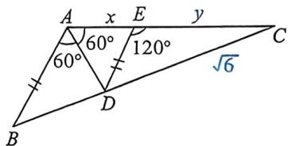

> [!faq]- 例题解析
>
> > [!success]- **【答案】** C
>
> > [!note]- **【解析】**
> > 解析：(题者理解) $AB = c$ ，则 $CD = \sqrt{6} c$ ，设 $\angle ABC = \theta, \theta \in \left(0, \frac{\pi}{3}\right)$ ，则 $\angle ACB = \frac{\pi}{3} - \theta$ ，在 $\triangle ABD$ 中，由正弦定理， $\frac{AB}{\sin \angle ADB} = \frac{BD}{\sin \frac{\pi}{3}}$ ，在 $\triangle ADC$ 中，由正弦定理， $\frac{AC}{\sin \angle ADC} = \frac{DC}{\sin \frac{\pi}{3}}$ ，因 $\sin \angle ADC = \sin \angle ADB$ ，两式相比，可得 $\frac{AB}{AC} = \frac{BD}{DC}$ ，所以 $BD = \frac{AB \times DC}{AC} = \frac{\sqrt{6}c^2}{b}$ ，所以 $BC = a = \sqrt{6}c + \frac{\sqrt{6}c^2}{b}$ ，由正弦定理得 $\frac{c}{\sin \left(\frac{\pi}{3} - \theta\right)} = \frac{b}{\sin \theta} = \frac{a}{\sin \frac{2\pi}{3}}$ ，所以 $\sqrt{6}\left[1 + \frac{\sin\left(\frac{\pi}{3} - \theta\right)}{\sin\theta}\right] = \frac{\sqrt{3}}{2\sin\left(\frac{\pi}{3} - \theta\right)}$ ，所以 $2\sqrt{2}\sin\left(\frac{\pi}{3} - \theta\right)\sin\theta + 2\sqrt{2}\sin^2\left(\frac{\pi}{3} - \theta\right) = \sin\theta$ ，化简得 $4\sin^2\theta + \sqrt{2}\sin\theta - 3 = 0$ ，所以 $\sin\theta = \frac{\sqrt{2}}{2}$ 或 $\sin\theta = -\frac{3\sqrt{2}}{4}$ （舍去），又 $\theta \in (0, \frac{\pi}{3})$ ，所以 $\theta = \frac{\pi}{4}$ ，所以 $\tan\angle ABC = \tan\theta = 1$ 。
> >
> > 
> >
> > 法二: 过 D 作 $DE \parallel AB$ 交 AC 于 E, 所以 $\angle ADE = \angle BAC = \angle DAC, \frac{EC}{AE} = \frac{CD}{BD}, |AE| = |DE|$ , 利用角平分线定理 $\frac{AB}{AC} = \frac{BD}{DC}$ , 令 $|AE| = x, |CE| = y$ , 故 $\frac{y}{x} = \frac{x + y}{1}, x^{2} + xy = y$ ①, 又 $|AE| = |DE|, \Delta ECD$ 中, $x^{2} + xy + y^{2} = 6$ , 结合①, $y^{2} + y = 6 \Rightarrow y = 2$ ,
> >
> > $\Delta EDC$ 中： $\frac{y}{\sin\angle EDC} = \frac{\sqrt{6}}{\sin 120^\circ}\Rightarrow \sin \angle EDC = \frac{\sqrt{2}}{2}.$ 所以 $\angle ABC = 45^{\circ}$
> >
> > 法三(角平分线三定理):如图, $|AE|=|DE|=|DE|=x$ , $AD^{2}=AB\cdot AC-BD\cdot DC\Rightarrow x^{2}=(x+y)-\sqrt{6}BD①$ ,由张角定理得 $\cos60^{\circ}=\frac{1}{2}=\frac{1}{2}\left(\frac{x}{AB}+\frac{x}{AC}\right)\Rightarrow x+\frac{x}{x+y}=1\Rightarrow x^{2}+xy-y=0$ ②,根据角平分线定理 $\frac{1}{x+y}=\frac{BD}{\sqrt{6}}$ ③,综合①②③y=2,之后正弦定理同法二,
> >
> > 故选 **C**.
