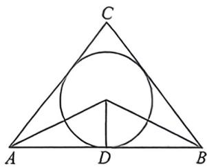

> [!faq]- 例题解析
>
> > [!success]- **【答案】** ； $\frac{2 + 2\sqrt{10}}{3}$
>
> > [!note]- **【解析】**
> > 解析 解法一: 由 $C \in (0, \pi)$ , 即 $\frac{C}{2} \in \left(0, \frac{\pi}{2}\right)$ , 则 $\tan \frac{C}{2} > 0$ , 同理 $\tan \frac{B}{2} > 0, \tan \frac{C}{2} > 0$ ,
> >
> > 而 $\cos C = \cos^2\frac{C}{2} -\sin^2\frac{C}{2} = \frac{\cos^2\frac{C}{2} - \sin^2\frac{C}{2}}{\cos^2\frac{C}{2} + \sin^2\frac{C}{2}} = \frac{1 - \tan^2\frac{C}{2}}{1 + \tan^2\frac{C}{2}} = \frac{4}{5},$ 解得 $\tan \frac{C}{2} = \frac{1}{3},$
> >
> > 设△ABC 的内切圆与 AB 边相切于点 D，而 $\tan\left(\frac{A}{2}+\frac{B}{2}\right)=\frac{\tan\frac{A}{2}+\tan\frac{B}{2}}{1-\tan\frac{A}{2}\tan\frac{B}{2}}=\tan\left(\frac{\pi-C}{2}\right)=\frac{1}{\tan\frac{C}{2}}=3$
> >
> > 则 $\tan \frac{A}{2} + \tan \frac{B}{2} = 3\left(1 - \tan \frac{A}{2} \tan \frac{B}{2}\right) \geqslant 2\sqrt{\tan \frac{A}{2} \tan \frac{B}{2}}$ ，即 $\sqrt{\tan \frac{A}{2} \tan \frac{B}{2}} \leqslant \frac{\sqrt{10} - 1}{3}$ ，当且仅当 $A = B$ 时等号成立，
> >
> > 所以 $0 < \tan \frac{A}{2} \tan \frac{B}{2} \leqslant \frac{11 - 2\sqrt{10}}{9}$ , 由图可知, $c = AD + BD = \frac{r}{\tan \frac{A}{2}} + \frac{r}{\tan \frac{B}{2}}$
> >
> > $$
> > = \frac {\tan \frac {A}{2} + \tan \frac {B}{2}}{\tan \frac {A}{2} \cdot \tan \frac {B}{2}}
> > $$
> >
> > 
> >
> > $= \frac{3\left(1 - \tan\frac{A}{2} \cdot \tan\frac{B}{2}\right)}{\tan\frac{A}{2} \cdot \tan\frac{B}{2}} = \frac{3}{\tan\frac{A}{2} \cdot \tan\frac{B}{2}} - 3 \geqslant \frac{2 + 2\sqrt{10}}{3}$ , 则边长 $c$ 的最小值为 $\frac{2 + 2\sqrt{10}}{3}$ .
> >
> > 解法二：由 $\cos C = \frac{4}{5}$ ，得 $\sin C = \sqrt{1 - \cos^2C} = \frac{3}{5}$ ，由 $S_{\triangle ABC} = \frac{1}{2} r(a + b + c) = \frac{1}{2} ab\sin C$ ，得 $a + b + c = \frac{3}{5} ab①$
> >
> > 由余弦定理有 $\cos C = \frac{a^2 + b^2 - c^2}{2ab} = \frac{(a + b + c)(a + b - c) - 2ab}{2ab} = \frac{\frac{3}{5}ab(a + b - c) - 2ab}{2ab} = \frac{\frac{3}{5}(a + b - c) - 2}{2} = \frac{4}{5},$
> >
> > 则 $a + b - c = 6$ ②，显然 $a + b > 6$ 。由①+②整理得 $a + b = 3 + \frac{3}{10} ab \leqslant 3 + \frac{3}{10} \times \frac{(a + b)^2}{4}$ ，解得 $a + b \geqslant \frac{20 + 2\sqrt{10}}{3}$ 或 $a + b$
> >
> >
> > $\leqslant \frac{20 - 2\sqrt{10}}{3}$ （舍去），则 $c = a + b - 6 \geqslant \frac{2 + 2\sqrt{10}}{3}$ ，当 $a = b = \frac{10 + \sqrt{10}}{3}$ 时等号成立，则边长 $c$ 的最小值为 $\frac{2 + 2\sqrt{10}}{3}$ . 故答案为； $\frac{2 + 2\sqrt{10}}{3}$ .
