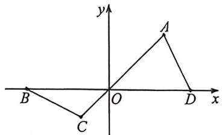
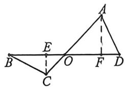
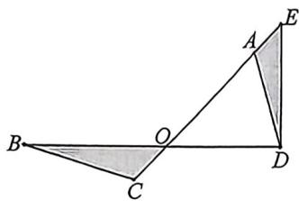

> [!faq]- 例题解析
>
> > [!success]- **【答案】** 详见解析
>
> > [!note]- **【解析】**
> > 解析 (1) 过 D 作 $DE \perp AO$ 于 E, $BF \perp OC$ 延长线于 F,
> >
> > $$
> > A D ^ {2} = x ^ {2} + y ^ {2} - \sqrt {2} x y = B C ^ {2} = (2 \sqrt {2} - y) ^ {2} + (2 - x) ^ {2} - \sqrt {2} (2 \sqrt {2} - y) (2 - x)
> > $$
> >
> > $\Rightarrow-2\sqrt{2}y+4=0,y=\sqrt{2}$ ，即O为BD中点.
> >
> > (2) 易证得: $\Delta ADE \sim \Delta CBF$
> >
> > $$
> > \angle A = \angle F C B = \angle O B C + 4 5 ^ {\circ}, \sqrt {5} \sin 2 A + \cos B = \sqrt {5} \sin (9 0 ^ {\circ} + 2 B) + \cos B = \sqrt {5}.
> > $$
> >
> > $\Rightarrow \sqrt{5}\cos 2B + \cos 2 = \sqrt{5}$ ，即 $2\sqrt{5}\cos^2 B + \cos B - 2\sqrt{5} = 0,\Rightarrow \cos B = \frac{2}{\sqrt{5}},\sin B = \frac{1}{\sqrt{5}}$
> >
> > 在 $\Delta OBC$ 中， $\frac{OC}{\sin B} = \frac{\sqrt{2}}{\sin C} = \frac{\sqrt{2}}{\sin (B + 45^\circ)} \Rightarrow OC = \frac{\sqrt{2}\sin B}{\sin (B + 45^\circ)} = \frac{2\sin B}{\sin B + \cos B} = \frac{2}{3}$ .
> >
> > 
> >
> > 法二:(1)如图建立直角坐标系,设 $OD = m, OA = n$ , 则由 $\angle AOD = \angle BOC = \frac{\pi}{4}, AC = 2, BD = 2\sqrt{2}$ 得点 $D(m,0), A$ $\left(\frac{\sqrt{2}n}{2}, \frac{\sqrt{2}n}{2}\right), B(m - 2\sqrt{2}, 0), C\left(\frac{\sqrt{2}}{2}(n - 2), \frac{\sqrt{2}}{2}(n - 2)\right)$ ,
> >
> > 再由 $BC = AD$ 得 $\left[\frac{\sqrt{2}}{2} (n - 2) - (m - 2\sqrt{2})\right]^2 +\left[\frac{\sqrt{2}}{2} (n - 2)\right]^2 = \left(\frac{\sqrt{2}n}{2} -m\right)^2 +\left(\frac{\sqrt{2}n}{2}\right)^2.$
> >
> > 化简得 $m=\sqrt{2}$ ，即 O 为 BD 中点。
> >
> > (2)在 $\triangle BOC$ 和 $\triangle AOD$ 中，由正弦定理得 $\frac{BO}{\sin C} = \frac{BC}{\sin\angle BOC} = \frac{AD}{\sin\angle AOD} = \frac{DO}{\sin A}$
> >
> > 由(1)知 BO=DO，进而得 $\sin A=\sin C$ 。由 A=C 不满足 $\sqrt{5}\sin2A+\cos B=\sqrt{5}$ 知 $A+C=\pi\Rightarrow A=\pi-C=\pi-\left(\pi-\frac{\pi}{4}-B\right)=B+\frac{\pi}{4}$ 。再由 $\sqrt{5}\sin2A+\cos B=\sqrt{5}$ 得
> >
> > $$
> > \sqrt {5} \sin 2 \left(B + \frac {\pi}{4}\right) + \cos B = \sqrt {5} \cos 2 B + \cos B = \sqrt {5} (2 \cos^ {2} B - 1) + \cos B = \sqrt {5}.
> > $$
> >
> > 解得 $\cos B=\frac{2\sqrt{5}}{5}$ ，或 $\cos B=-\frac{\sqrt{5}}{2}$ （舍）.
> >
> > 此时 $\sin B = \frac{\sqrt{5}}{5},\sin C = \sin \left(\frac{3\pi}{4} -B\right) = \frac{\sqrt{2}}{2} (\sin B + \cos B) = \frac{3\sqrt{10}}{10}.$
> >
> > 在 $\Delta BOC$ 中，由正弦定理得 $\frac{OC}{\sin B} = \frac{OB}{\sin C}$ ，故 $OC = \frac{2}{3}$ .
> >
> > 法三:(作垂线构造等腰直角三角形)(1)过点 C, A 分别作 $CE \perp BD$ 交 BD 于点 E, $AF \perp BD$ 交 BD 于点 F, 设 OE = x, BE = y, 再由 $\angle AOD = \angle BOC = \frac{\pi}{4}$
> >
> > 得 $CE = OE = x, EF = OE + OF = OC \cdot \sin \frac{\pi}{4} + OA \cdot \sin \frac{\pi}{4} = \sqrt{2}$ , 故 $OF = AF = \sqrt{2} - x$ , 进而可得 $DF = \sqrt{2} - y$ , 再由
> >
> >
> >
> > $BC = AD$
> >
> > 得 $BE^{2} + CE^{2} = AF^{2} + DF^{2}x + y = \sqrt{2}\Rightarrow y^{2} + x^{2} = (\sqrt{2} -x)^{2} + (\sqrt{2} -y)^{2}.$
> >
> > 所以, $BO=\frac{1}{2}BD$ ,即O为BD中点.
> >
> > (2)由(1)知 $CE = OE = DF = x, AF = OF = BE = \sqrt{2} - x$ , 故 $\triangle BCE \cong \triangle ADF \Rightarrow \angle OAD = \angle OAF + \angle FAD = \frac{\pi}{4} + B$ . 由 $\sqrt{5}\sin 2A + \cos B = \sqrt{5}$ 得
> >
> > 
> >
> > $$
> > \sqrt {5} \sin 2 \left(B + \frac {\pi}{4}\right) + \cos B = \sqrt {5} \cos 2 B + \cos B = \sqrt {5} (2 \cos^ {2} B - 1) + \cos B = \sqrt {5}.
> > $$
> >
> > 解得 $\cos B=\frac{2\sqrt{5}}{5}$ ，或 $\cos B=-\frac{\sqrt{5}}{2}$ （舍）.
> >
> > 此时 $\sin B = \frac{\sqrt{5}}{5} \Rightarrow \tan B = \frac{CE}{BE} = \frac{x}{\sqrt{2} - x} = \frac{1}{2} \Rightarrow x = \frac{\sqrt{2}}{3} \Rightarrow AC = \frac{2}{3}$ .
> >
> > 
> >
> > 法四:(截长补短) $\Delta OBC\cong\Delta EDA(SSS)$ ，所以 $\angle OAD-\angle B=45^{\circ}$ ，所以易得 $\cos B=\frac{2}{\sqrt{5}}$ ;
> >
> > $\frac{OC}{\sin B} = \frac{OB}{\sin C} \Rightarrow \frac{OC}{\frac{1}{\sqrt{5}}} = \frac{\sqrt{2}}{\sin(B + 45^\circ)}$ ，所以 $OC = \frac{2}{3}$
