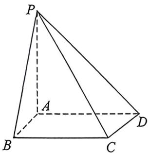
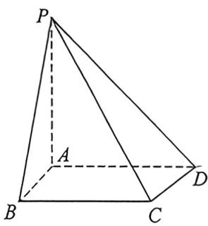

<!-- question-source:start -->
例1 (2025全国新课标I卷·T17)如图所示的四棱锥 $P - ABCD$ 中， $PA$ 上平面ABCD, $BC \parallel AD$ , $AB \perp AD$ .

(1)证明:平面PAB⊥平面PAD;

(2)若 $PA = AB = \sqrt{2}, AD = \sqrt{3} + 1, BC = 2, P, B, C, D$ 在同一个球面上，设该球面的球心为 $O$ .

(1)证明: $O$ 在平面 $ABCD$ 上;

(Ⅱ)求直线 AC 与直线 PO 所成角的余弦值.
<!-- question-source:end -->

![[高中/总复习/二轮/2026版高中《MST新思路思维拓展》二轮复习专题/上册/立体几何/考点一_常见空间角度计算T17类型/questions/answers/Q00093012A1.md]]
