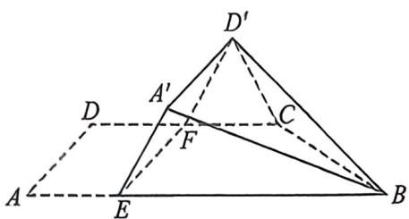
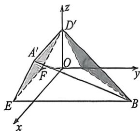

<!-- question-source:start -->
例2 (2025全国新课标Ⅱ卷·T17)如图,四边形ABCD中, $AB//CD,\angle DAB=90^{\circ},F$ 为CD中点,E在

AB 上, $EF \parallel AD$ , AB = 3AD, CD = 2AD。将四边形 EFDA 沿 EF 翻折至四边形 $EF D'A'$ ，使得面 $EF D'A'$ 与面 CFB 所成的二面角为 $60^{\circ}$ 。

(1) 证明: $A'B \parallel$ 平面 $CD'F$ ;

(2)求面 $BCD'$ 与面 $EFD'A'$ 所成二面角的正弦值。

<!-- question-source:end -->

![[高中/总复习/二轮/2026版高中《MST新思路思维拓展》二轮复习专题/上册/立体几何/考点一_常见空间角度计算T17类型/questions/answers/Q00093013A1.md]]
