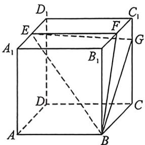
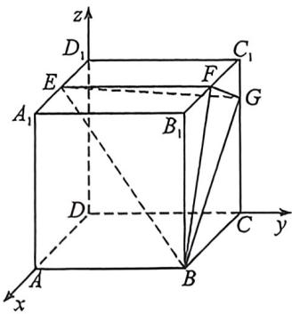

<!-- question-source:start -->
例4 (2025 天津卷·T17) 正方体 $ABCD - A_{1}B_{1}C_{1}D_{1}$ 的棱长为 4, E、F 分别为 $A_{1}D_{1}, C_{1}B_{1}$ 中点, $CG = 3GC_{1}$ .

(1)求证: $GF \perp$ 平面 $FBE$ ;

(2)求平面 FBE 与平面 EBG 夹角的余弦值;

(3)求三棱锥 D-FBE 的体积.
<!-- question-source:end -->

![[高中/总复习/二轮/2026版高中《MST新思路思维拓展》二轮复习专题/上册/立体几何/考点一_常见空间角度计算T17类型/questions/answers/Q00093014A1.md]]
