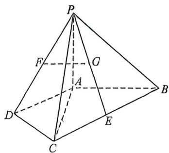
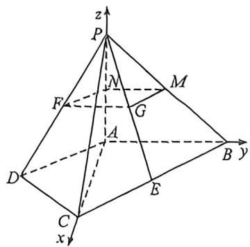

> [!faq]- 例题解析
>
> > [!success]- **【答案】** AB
>
> > [!note]- **【解析】**
> > 解析 是提 $D'$ 和 $C$ , 由题意可知在四边形 $ABCD$ 中 $DF = \frac{1}{2} DC = AD, AE = \frac{1}{3} AB = AD$ , 又 $AB // CD$ , 故 $DF // AE$ 且 $DF = AE$ , 则四边形 $DFAE$ 为平行四边形, 故 $AD // EF$ , 故在空间几何体 $A'D'EBCF$ 中, $A'D'EF$ 仍为平行四边形 (1) 由翻折图形性质可知 $A'E // D'F$ , 因为 $D'F \in CD'F, A'E \not\subset$ 平面 $CD'F$ , 所以 $A'E // CD'F$ , 又 $CF // EB$ , 同理 $EB // CD'F$ , 又 $A'E \cap EB$ , 所以平面 $A'EB //$ 平面 $CD'F$ , 所以 $A'B //$ 平面 $CD'F$
> >
> > (2)记线段 $FC$ 中点为 $O$ , 连接 $OD'$ , 因为 $\angle DAB = 90^\circ$ , 所以 $A'D'EF$ 为矩形, 所以 $D'F \perp F, CF \perp FE$ , 所以 $\angle D'FC$ 为 $EFD'A'$ 与面 $CFB$ 所成的二面角的平面角, 所以 $\angle D'FC = 60^\circ$ , 且 $EF \perp CD'F$ , 所以 $EF \perp D'O$ , 设 $AD = 1$ , 则 $D'F = FC = 1, FO = \frac{1}{2}$ , 因为 $\angle D'FC = 60^\circ$ , 所以 $OD' = \frac{\sqrt{3}}{2}$ , 所以 $D'O \perp FC$ , 所以 $D'O \perp EFCB$ , 在平面 $EFCB$ 作 $Ox \perp CF$ , 以 $O$ 为原点, 以 $\overrightarrow{Ox}, \overrightarrow{OC}, \overrightarrow{OD'}$ 分别为 $x, y, z$ 轴正方向建立空间直角坐标系; 则 $F(0, -\frac{1}{2}, 0), E(1, -\frac{1}{2}, 0)$ , $D'(0, 0, \frac{\sqrt{3}}{2}), C(0, \frac{1}{2}, 0), B(1, \frac{3}{2}, 0)$ , 故 $\overrightarrow{CB} = (1, 1, 0), \overrightarrow{CD'} = (0, -\frac{1}{2}, \frac{\sqrt{3}}{2}), \overrightarrow{FE} = (1, 0, 0), \overrightarrow{FD'} = (0, \frac{1}{2}, \frac{\sqrt{3}}{2})$ , 设面 $BCD'$ 与面 $EFD'A'$ 的法向量分别为 $n_1 = (x_1, y_1, z_1), n_2 = (x_2, y_2, z_2)$
> >
> > 则 $\left\{ \begin{array}{l} \overrightarrow{CB} \cdot n_1 = 0 \\ \overrightarrow{GD} \cdot n_1 = 0 \end{array} \right.$ ，得 $\left\{ \begin{array}{l} x_1 + y_1 = 0 \\ -\frac{1}{2} y_1 + \frac{\sqrt{3}}{2} z_1 = 0 \end{array} \right.$ ，令 $z_1 = 1$ ，则 $y_1 = \sqrt{3}$ ， $x_1 = -\sqrt{3}$ ，故 $n_1 = (-\sqrt{3}, \sqrt{3}, 1)$ ；
> >
> > 则 $\left\{ \begin{array}{l} \overrightarrow{FE} \cdot n_2 = 0 \\ \overrightarrow{FD'} \cdot n_2 = 0 \end{array} \right.$ ，得 $\left\{ \begin{array}{l} x_2 = 0 \\ \frac{1}{2} y_2 + \frac{\sqrt{3}}{2} z_2 = 0 \end{array} \right.$ ，令 $x_2 = 1$ ，则 $y_2 = -\sqrt{3}, x_2 = 0$ ，故 $n_2 = (0, -\sqrt{3}, 1)$ ，记面 $BCD'$ 与面 $EFD'A'$ 所成二面角为 $\theta$ ，则 $\cos \theta = \frac{|n_1 \cdot n_2|}{|n_1| \cdot |n_2|} = \frac{2}{\sqrt{7} \times 2} = \frac{\sqrt{7}}{7}$ ，故 $\sin \theta = \frac{\sqrt{42}}{7}$ .
> >
> > 例J（2025北京卷·T17）四棱锥 $P - ABCD$ 中， $\triangle ACD$ 与 $\triangle ABC$ 为等腰直角三角形， $\angle ADC = 90^{\circ}$ $\angle BAC = 90^{\circ},E$ 为 $BC$ 的中点.
> >
> > 
> >
> > 
> >
> > (1) F 为 PD 的中点, G 为 PE 的中点, 证明: FG // 面 PAB;
> >
> > (2)若 $PA \perp$ 面 $ABCD, PA = AC$ , 求 $AB$ 与面 $PCD$ 所成角的正弦值.
> >
> > 解析 (1) 取 $PA$ 的中点 $N, PB$ 的中点 $M$ , 连接 $FN, MN$ ,
> >
> > 因为 $\triangle ACD$ 与 $\triangle ABC$ 为等腰直角三角形 $\angle ADC = 90^{\circ}\angle BAC = 90^{\circ}$ , 不妨设 $AD - CD = 2$ 所以 $AC = AB = 2\sqrt{2}$ 所以 $BC = 4$ , 因为 $E, F$ 分别为 $BC, PD$ 的中点, 所以 $FN = \frac{1}{2} AD = 1, BE = 2$ , 所以 $GM = 1$ ,
> >
> > 因为 $\angle DAC = 45^{\circ}, \angle ACB = 45^{\circ}$ 所以 $AD \parallel BC$ , 所以 $FN \parallel GM$ , 所以四边形 $FG \parallel MN$ 为平行四边形, 所以 $FG \parallel MN$ , 因为 $FG \nsubseteq$ 面 $PAB, MN \subset$ 面 $PAB$ , 所以 $FG \parallel$ 面 $PAB$ ;
> >
> > (2) 因为 $PA \perp$ 面 $ABCD$ , 所以以 $A$ 为原点, $AC, AB, AP$ 所在直线分别为 $x, y, x$ 轴建立如图所示的空间直角坐标系, 设 $AD = CD = 2$ , 则 $A(0,0,0), B(0,2\sqrt{2},0), C(2\sqrt{2},0,0)D(\sqrt{2}, -\sqrt{2},0), P(0,0,2\sqrt{2})$ ,
> >
> > 所以 $\overrightarrow{AB} = (0,2\sqrt{2},0)$ ， $\overrightarrow{DC} = (\sqrt{2},\sqrt{2},0)$ ， $\overrightarrow{CP} = (-2\sqrt{2},0,2\sqrt{2})$
> >
> > 设面 $PCD$ 的一个法向量为 $n = (x,y,z)$ ，所以 $\left\{ \begin{array}{l} \overrightarrow{DC} \cdot n = 0 \\ \overrightarrow{CP} \cdot n = 0 \end{array} \right.$ ，所以 $\left\{ \begin{array}{l} \sqrt{2} x + \sqrt{2} y = 0 \\ -2\sqrt{2} x + 2\sqrt{2} z = 0 \end{array} \right.$
> >
> > 取 $x = 1$ ，所以 $y = -1, z = 1$ ，所以 $n = (1, -1, 1)$ ，设 $AB$ 与面 $PCD$ 成的角为 $\theta$
> >
> > $$
> > \sin \theta = | \cos \langle \overrightarrow {A B}, n \rangle | = \frac {\overrightarrow {A B} \cdot n}{| \overrightarrow {A B} \cdot n |} = \frac {| 0 \times 1 + 2 \sqrt {2} \times (- 1) + 0 \times 1 |}{2 \sqrt {2} \cdot \sqrt {1 ^ {2} + (- 1) ^ {2} + 1 ^ {2}}} = \frac {2 \sqrt {2}}{2 \sqrt {2} \sqrt {3}} = \frac {\sqrt {3}}{3},
> > $$
> >
> > 即 AB 与平面 PCD 成角的正弦值为 $\frac{\sqrt{3}}{3}$ .
