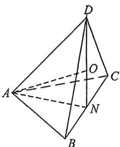

<!-- question-source:start -->
例16 (2026 届广东惠州九月月考 T8) 已知 A, B, C, D 四点均在半径为 R (R 为常数) 的球 O 的球面上运动，且 AB = AC, AB ⊥ AC, AD ⊥ BC，若四面体 ABCD 的体积的最大值为 $\frac{4}{3}$ ，则球 O 的表面积为 (
A. $4\pi$ B. $6\pi$ C. $8\pi$ D. $9\pi$

<!-- question-source:end -->

![[高中/总复习/二轮/2026版高中《MST新思路思维拓展》二轮复习专题/上册/立体几何/考点三_外接内切球综合问题/questions/answers/Q00093028A1.md]]
