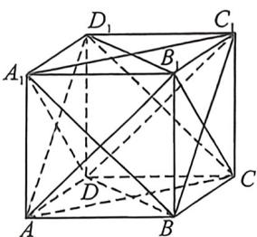
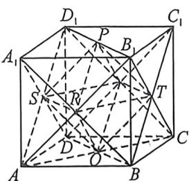
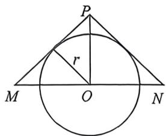

<!-- question-source:start -->
例21 (长沙市一中 2026 届高三月考试卷(二),T8)如图是棱长为 2 的正方体 $ABCD-A_{1}B_{1}C_{1}D_{1}$ , 则两个三棱锥 $D-A_{1}BC_{1}, B_{1}-AD_{1}C$ 的公共部分的内切球的表面积为( ) $\frac{\pi}{3}$ B. $\frac{2\pi}{3}$ C. $\frac{4\pi}{3}$ D. $\frac{8\pi}{3}$

<!-- question-source:end -->

![[高中/总复习/二轮/2026版高中《MST新思路思维拓展》二轮复习专题/上册/立体几何/考点三_外接内切球综合问题/questions/answers/Q00093032A1.md]]
