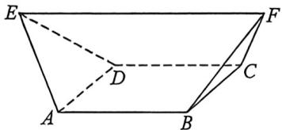
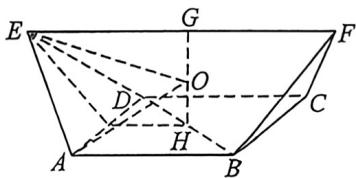

<!-- question-source:start -->
例26 (2026 届石家庄一中学高三年级统底考 T13)《九章算术》中记录的“刍甍”是算学和建筑学术语, 指的是一段类似隧道形状的几何体, 如图, 当甍 $ABCDEF$ 中, 底面 $ABCD$ 是正方形, $EF \parallel$ 平面 $ABCD$ , $\triangle ADE$ 和 $\triangle BCF$ 均为等边三角形, 且 $EF = 2AB = 6$ . 则这个几何体的外接球的体积为 \_\_\_\_.

<!-- question-source:end -->

![[高中/总复习/二轮/2026版高中《MST新思路思维拓展》二轮复习专题/上册/立体几何/考点三_外接内切球综合问题/questions/answers/Q00093036A1.md]]
