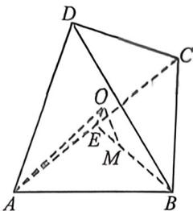

<!-- question-source:start -->
例27 (25·云南师大附中高三月考卷(三)T14)在平面四边形ABCD中, $AD \perp CD$ , $\triangle ABC$ 是边长为6的正三角形. 将该四边形沿对角线AC折成一个大小为 $\theta, \theta \in \left[\frac{\pi}{6}, \frac{5\pi}{6}\right]$ 的二面角D-AC-B, 则四面体ABCD的外接球半径的取值范围为\_\_\_\_.

<!-- question-source:end -->

![[高中/总复习/二轮/2026版高中《MST新思路思维拓展》二轮复习专题/上册/立体几何/考点三_外接内切球综合问题/questions/answers/Q00093037A1.md]]
