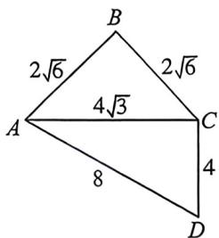
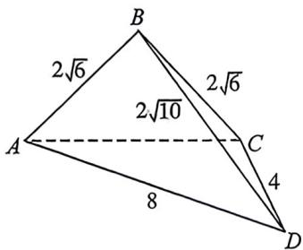
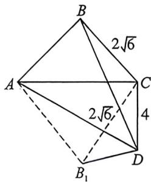

<!-- question-source:start -->
例28 (2025·黑龙江佳木斯·三模·多选)如图1所示,在四边形ABCD中, $\angle ABC=\angle ACD=\frac{\pi}{2}$ , $\angle CAD=\frac{\pi}{6}$ , AB=BC= $2\sqrt{6}$ . 如图2所示,把 $\triangle ABC$ 沿AC边折起,使点B不在平面ACD内,连接BD.则下列选项正确的是() A.当平面ABC⊥平面ACD时,点C到平面ABD的距离为 $\frac{4\sqrt{15}}{5}$ B. 异面直线 AB 与 CD 所成角的取值范围为 $\left(\frac{\pi}{4}, \frac{\pi}{2}\right]$ C. M、N 分别为 CD、BC 的中点, 在翻折的过程中, 存在某个位置, 使得 $MN = \sqrt{30}$ D. 三棱锥 B-ACD 的外接球的表面积的最小值为 $64\pi$

<!-- question-source:end -->

![[高中/总复习/二轮/2026版高中《MST新思路思维拓展》二轮复习专题/上册/立体几何/考点三_外接内切球综合问题/questions/answers/Q00093038A1.md]]
