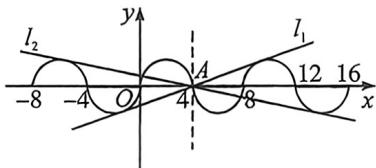
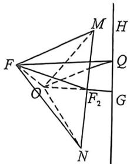

<!-- question-source:start -->
例29 (2025·湖北恩施·模拟预测)已知 O 为坐标原点, 已知双曲线 $C: x^{2} - \frac{y^{2}}{3} = 1$ 的左右焦点分别为 $F_{1}$ , $F_{2}$ , 过 $F_{2}$ 作 $OF_{2}$ 的垂线交双曲线于 M, N, 现将 y 轴左侧的半平面绕 y 轴旋转 $\frac{\pi}{3}$ , 原来的左焦点 $F_{1}$ 经旋转后得到点 F, 求三棱锥 F-MON 的外接球表面积为
A. $158\pi$ B. $79\pi$ C. $\frac{79\pi}{2}$ D. $\frac{237\pi}{4}$

<!-- question-source:end -->

![[高中/总复习/二轮/2026版高中《MST新思路思维拓展》二轮复习专题/上册/立体几何/考点三_外接内切球综合问题/questions/answers/Q00093039A1.md]]
