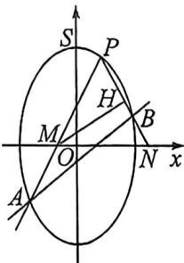
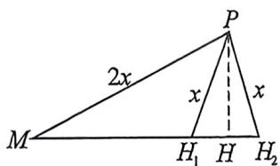
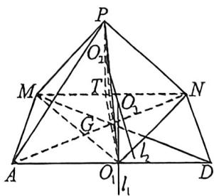

<!-- question-source:start -->
例32 (2025·成都外国语联盟模拟19题)在平面直角坐标系中,分别以x轴和y轴为实轴和虚轴建立复平面.已知复数 $z=x+yi(x,y\in\mathbf{R})$ ,在复平面内满足 $|z+2i|+|z-2i|$ .为定值的点Z的轨迹为曲线 $\Gamma$ .且点 $P(1,\sqrt{3})$ 在曲线 $\Gamma$ 上.

(1)求曲线 T 的平面直角坐标系方程;

(2)若斜率为 $\sqrt{3}$ 的直线 $l$ 与曲线 $\Gamma$ 交于 $A、B$ 两点(直线 $PA$ 斜率为正), 直线 $PA、PB$ (若 $P、B$ 重合, 直线 $PB$ 即为椭圆 $\Gamma$ 在 $P$ 点处的切线)分别与 $x$ 轴交于 $M、N$ 两点, $H$ 为 $PN$ 中点.

(i) 证明: $k_{PA} + k_{PB}$ 为定值;

(ii) $\angle PMH$ 最大时, 将坐标平面沿 $x$ 轴折成二面角 $P-MN-A$ , 在二面角 $P-MN-A$ 大小变化过程中, 求三棱锥 $P-MNA$ 外接球的半径最小时, 三棱锥 $P-MNA$ 的表面积.

<!-- question-source:end -->

![[高中/总复习/二轮/2026版高中《MST新思路思维拓展》二轮复习专题/上册/立体几何/考点三_外接内切球综合问题/questions/answers/Q00093043A1.md]]
