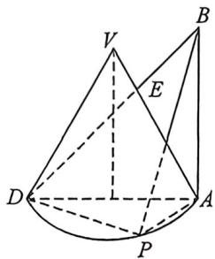
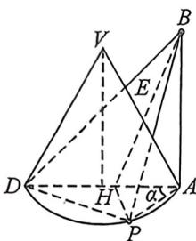

<!-- question-source:start -->
例19 (湖北襄阳市第四中学高三开学综合测试,T11,多选)如图,半圆锥的底面直径为 $AD = 2$ , 母线 $VA = 2, P$ 为圆弧 $AD$ 上任意一点(不包括 $A, D$ 两点), 直线 $AB$ 垂直于平面 $ADP$ , 且 $AB = 2$ . 连结 $BD$ 交母线 $VA$ 于点 $E$ . 下列结论正确的是 ( )

A. 三棱锥 $P - ABD$ 的 4 个面均为直角三角形 B. $VE = 4 - 2\sqrt{3}$

C. 沿此半圆锥的曲侧面从点 $D$ 到达点 $E$ 的最短距离为 2

D. 当直线 $PB$ 与平面 $VAD$ 所成角最大时, 平面 $PAB$ 截三棱锥 $P-ABD$ 外接球所得截面的面积为 $\sqrt{2}\pi$
<!-- question-source:end -->

![[高中/总复习/二轮/2026版高中《MST新思路思维拓展》二轮复习专题/上册/立体几何/考点三_外接内切球综合问题/questions/answers/Q00093312A1.md]]
