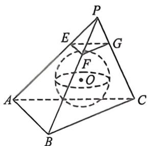
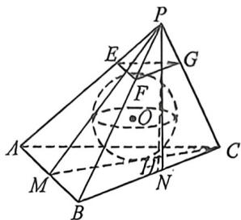

<!-- question-source:start -->
例2 (2025·八省第一次联考)如图,在三棱锥 $P-ABC$ 中, $PA=PB=CA=CB=2$ , $\angle APB=\angle ACB=\frac{\pi}{2}$ , $E,F,G$ 分别为 $PA,PB,PC$ 上靠近点 $P$ 的三等分点,若此时恰好存在一个小球与三棱锥 $P-ABC$ 的四个面均相切,且小球同时还与平面 $EFG$ 相切,则 $PC=$

A. $\sqrt{6} +\sqrt{2}$ B. $\sqrt{6} -\sqrt{2}$ C. $\sqrt{13} +1$ D. $\sqrt{13} -1$
<!-- question-source:end -->

![[高中/总复习/二轮/2026版高中《MST新思路思维拓展》二轮复习专题/上册/立体几何/考点三_外接内切球综合问题/questions/answers/Q00093343A1.md]]
