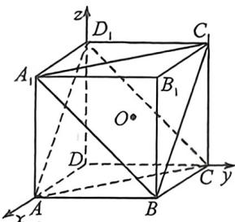
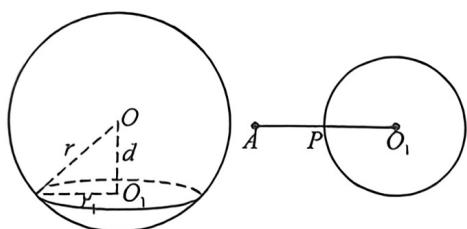

<!-- question-source:start -->
例23 (2025·南京六校联合体 8月调研, T14) 已知正方体 ABCD - A₁B₁C₁D₁ 的棱长为 2，点 P 在正方体例23 (2025·南京六校联合体8月调研,T14)已知正方体 $ABCD-A_{1}B_{1}C_{1}D_{1}$ 的棱长为2,点P在正方体的内切球表面上运动,且满足 $D_{1}P//$ 平面 $A_{1}BC_{1}$ ,则AP的最小值为\_\_\_\_.

<!-- question-source:end -->

![[高中/总复习/二轮/2026版高中《MST新思路思维拓展》二轮复习专题/上册/立体几何/考点三_外接内切球综合问题/questions/answers/Q00093344A1.md]]
